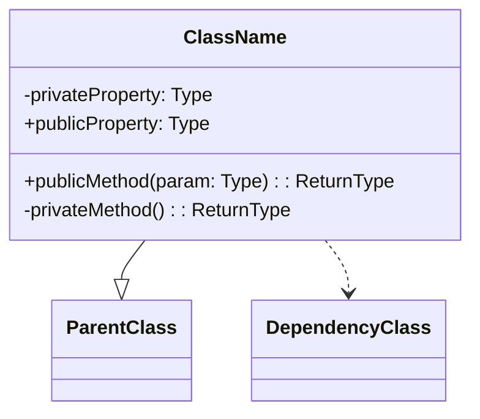
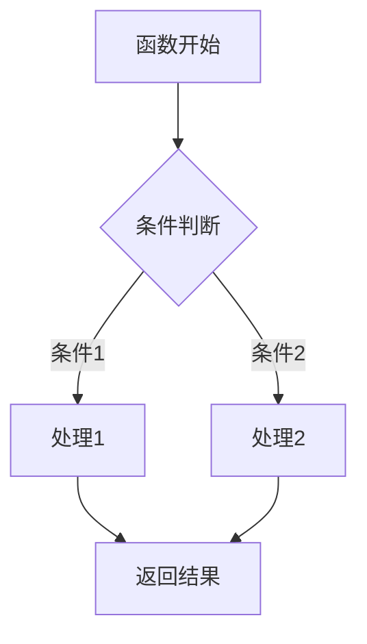

# Android 项目 Kotlin 代码文件分析提示词

## 项目技术栈

- **编程语言**：Kotlin - 现代 JVM 语言，支持函数式编程和协程
- **UI 框架**：Jetpack Compose - Android 声明式 UI 框架
- **构建工具**：Gradle - 灵活的项目自动化构建工具

## 分析要求

请根据以下要求对提供的 Android Kotlin 代码文件进行全面分析：

### 1. 文件基本信息

- **文件名称**：提供完整文件名
- **文件路径**：在项目中的相对路径
- **主要功能**：简要概述文件的核心功能和职责
- **技术要点**：列出文件中使用的关键技术点和特性

### 2. 分层架构分析

#### 2.1 界面层（UI Layer）

- **组件结构**：使用 ASCII 树形图展示 UI 组件结构

  ```plaintext
  ParentComponent/                  # 父组件说明
  ├── ChildComponent1/              # 子组件1说明
  │   ├── GrandchildComponent1.1/   # 孙组件1.1说明
  │   └── GrandchildComponent1.2/   # 孙组件1.2说明
  └── ChildComponent2/              # 子组件2说明
  ```

- **状态管理**：分析组件的状态管理方式（如 rememberSaveable、collectAsState、MutableState 等）
- **Compose 特性**：分析使用的特殊 Compose 特性（如 LaunchedEffect、rememberCoroutineScope、派生状态等）
- **组件交互**：说明组件间通信和事件处理机制

#### 2.2 业务层（Domain Layer）

- **业务流程**：使用 Mermaid 语法绘制业务流程图

  ```mermaid
  graph LR
      A[事件输入] --> B[业务处理]
      B --> C[状态更新]
      C --> D[UI 刷新]
  ```

- **ViewModel 分析**：详细说明 ViewModel 的职责、状态管理和事件处理
- **UseCase 分析**：分析业务用例实现
- **依赖注入**：说明依赖注入的实现方式和组件关系

#### 2.3 数据层（Data Layer）

- **数据结构**：使用 Mermaid 语法绘制数据关系图

  ```mermaid
  graph TD
      A[Repository] --> B[远程数据源]
      A --> C[本地数据源]
      B --> D[网络API]
      C --> E[数据库]
  ```

- **数据流向**：描述数据如何从源头流向 UI
- **数据转换**：分析数据模型间的映射和转换
- **持久化策略**：分析数据缓存和持久化实现

### 3. 代码质量分析

- **设计模式**：识别并说明代码中使用的设计模式
- **Kotlin 特性**：分析使用的 Kotlin 高级特性（如扩展函数、高阶函数、DSL 等）
- **异步处理**：分析协程和 Flow 的使用方式
- **性能考虑**：指出与性能相关的关键点（如 Compose 重组优化）

### 4. UML 类图

使用 Mermaid 语法绘制代码中关键类的 UML 类图：



### 5. 业务函数流程图

对关键业务函数使用 Mermaid 语法绘制详细流程图：



### 6. API 使用分析

- **重要 API**：列出代码文件中使用的重要 API

  | API 名称 | 用途 | 文档链接 |
  |---------|------|---------|
  | API 1   | 用途说明 | [链接](https://example.com) |
  | API 2   | 用途说明 | [链接](https://example.com) |

- **第三方库**：分析使用的第三方库及其用途

### 7. Compose 特定分析（如适用）

- **Composable 函数**：分析关键 Composable 函数的参数和返回结构
- **重组优化**：分析使用的记忆化策略（remember、derivedStateOf 等）
- **副作用处理**：分析副作用管理（LaunchedEffect、SideEffect 等）
- **主题与样式**：分析主题系统和样式处理

### 8. 注意事项与最佳实践

- **优点**：指出代码中值得学习的良好实践
- **改进空间**：提出可能的改进建议
- **风险点**：指出潜在的风险或问题

## 分析结果输出要求

- **任务**：将分析结果整理为标准化文档。
- **输出格式**：
  - 分析结果应输出为一个 Markdown 文件，文件名称为：`[原代码文件名].md`（不含扩展名）
  - 将文件保存在与分析的代码文件相同的目录下，便于关联查阅。
  - 文档须遵循严格的 Markdown 规范和中文排版规范。
  - 文档应包含清晰的标题层级、格式统一的列表和适当的代码块标注。

- **格式规范**：
  1. 标题层级：使用合理的标题层级结构（#、##、### 等）
  2. 代码块：使用 ``` 进行正确的代码块标记，并注明语言类型
  3. 图表：使用 ASCII 字符画或 Mermaid 代码块创建流程图、类图等
  4. 表格：使用 Markdown 标准表格语法
  5. 链接：为 API 文档提供有效的链接
  6. 排版：遵循中文文案排版规范
     - 中英文之间需要增加空格
     - 中文与数字之间需要增加空格
     - 数字与单位之间需要增加空格
     - 行内代码与中文之间需要空格
     - 使用全角中文标点符号
     - 专有名词使用正确的大小写

- **参考资料**：
  - Markdown 语法指南: [https://www.markdownguide.org](https://www.markdownguide.org)
  - 中文文案排版指北: [https://github.com/sparanoid/chinese-copywriting-guidelines](https://github.com/sparanoid/chinese-copywriting-guidelines)

## 分析输出示例

以下是针对某个 Jetpack Compose 文件的分析输出示例片段：

```markdown
    # `ExampleViewModel.kt` 代码分析

    ## 1. 文件基本信息

    - **文件名称**：`ExampleViewModel.kt`
    - **文件路径**：`app/src/main/java/com/example/myapp/ui/example/ExampleViewModel.kt`
    - **主要功能**：管理示例屏幕的 UI 状态和用户交互，处理数据加载和状态转换
    - **技术要点**：ViewModel、StateFlow、协程、依赖注入

    ## 2. 分层架构分析

    ### 2.1 界面层（UI Layer）

    此文件作为 UI 层与业务层之间的桥梁，主要负责为 `ExampleScreen.kt` 提供状态数据

    - **组件结构**：

      ```plaintext
      ExampleScreen/                       # 示例屏幕主容器
      ├── TopAppBar/                       # 顶部应用栏
      │   ├── Title                        # 标题文本
      │   └── ActionButtons                # 操作按钮组
      ├── ContentSection/                  # 内容区域
      │   ├── LoadingIndicator            # 加载指示器
      │   ├── ItemsList/                   # 项目列表
      │   │   ├── ItemCard                 # 单个项目卡片
      │   │   └── ItemDetails              # 项目详情内容
      │   └── EmptyState                   # 空数据状态提示
      └── BottomActions/                   # 底部操作区
          ├── PrimaryButton                # 主要操作按钮
          └── SecondaryButton              # 次要操作按钮
      ```

    ### 2.2 业务层（Domain Layer）

    - **业务流程**：

        ```mermaid
        graph LR
            A[用户操作] --> B[ViewModel 处理]
            B --> C[调用 UseCase]
            C --> D[获取数据]
            D --> E[转换数据模型]
            E --> F[更新 UI 状态]
            F --> G[界面重组]
        ```

    - **ViewModel 分析**：
      - 使用 StateFlow 管理 UI 状态
      - 通过依赖注入获取必要的 UseCase
      - 使用 viewModelScope 管理协程生命周期

    ### 2.3 数据层（Data Layer）

    - **数据结构**：

        ```mermaid
        graph TD
            A[ExampleViewModel] --> B[ExampleUseCase]
            B --> C[ExampleRepository]
            C --> D[RemoteDataSource]
            C --> E[LocalDataSource]
        ```

    ## 3. 代码质量分析

    - **设计模式**：
      - 观察者模式：通过 StateFlow 实现状态观察
      - 仓库模式：封装数据来源
      - 单例模式：通过依赖注入提供单例实例

    - **Kotlin 特性**：
      - 使用扩展函数简化数据转换
      - 利用密封类表示有限状态集合
      - 使用 let、also、apply 等范围函数简化代码

    ## 4. UML 类图

    ```mermaid
    classDiagram
        class ExampleViewModel {
            -_uiState: MutableStateFlow<ExampleUiState>
            +uiState: StateFlow<ExampleUiState>
            +loadData(): Unit
            +handleEvent(event: ExampleEvent): Unit
            -processData(data: List<Item>): ExampleUiState
        }
        
        class ExampleUiState {
            +loading: Boolean
            +items: List<ItemUiModel>
            +error: String?
        }
        
        class ExampleEvent {
            <<sealed>>
            +Refresh
            +ItemSelected(id: String)
        }
        
        ExampleViewModel --> ExampleUiState
        ExampleViewModel --> ExampleEvent
    ```

    ## 5. 业务函数流程图

    ```mermaid
    flowchart TD
        A[loadData 开始] --> B{检查缓存}
        B -->|有缓存| C[返回缓存数据]
        B -->|无缓存| D[网络请求]
        D --> E{请求结果}
        E -->|成功| F[处理数据]
        E -->|失败| G[显示错误]
        F --> H[更新 UI 状态]
        G --> H
        C --> H
        H --> I[结束]
    ```

    ## 6. API 使用分析

    - **重要 API**：

        | API 名称 | 用途 | 文档链接 |
        |---------|------|---------|
        | StateFlow | 管理响应式 UI 状态 | [StateFlow 文档](https://kotlin.github.io/kotlinx.coroutines/kotlinx-coroutines-core/kotlinx.coroutines.flow/-state-flow/) |
        | viewModelScope | 管理 ViewModel 协程生命周期 | [ViewModel KTX 文档](https://developer.android.com/kotlin/ktx#viewmodel) |
        | Hilt | 依赖注入 | [Hilt 文档](https://developer.android.com/training/dependency-injection/hilt-android) |

    ## 7. 注意事项与最佳实践

    - **优点**：
      - 清晰的状态管理和数据流向
      - 良好的错误处理和加载状态展示
      - 充分利用 Kotlin 特性简化代码

    - **改进空间**：
      - 可以添加单元测试提高代码质量
      - 考虑使用 SavedStateHandle 保存状态
      - 进一步优化协程使用方式
```

上面的示例展示了如何对 Android Kotlin 文件进行分析，包含了主要的分析点和格式规范。实际分析时，应根据具体代码文件的特点进行针对性分析。
