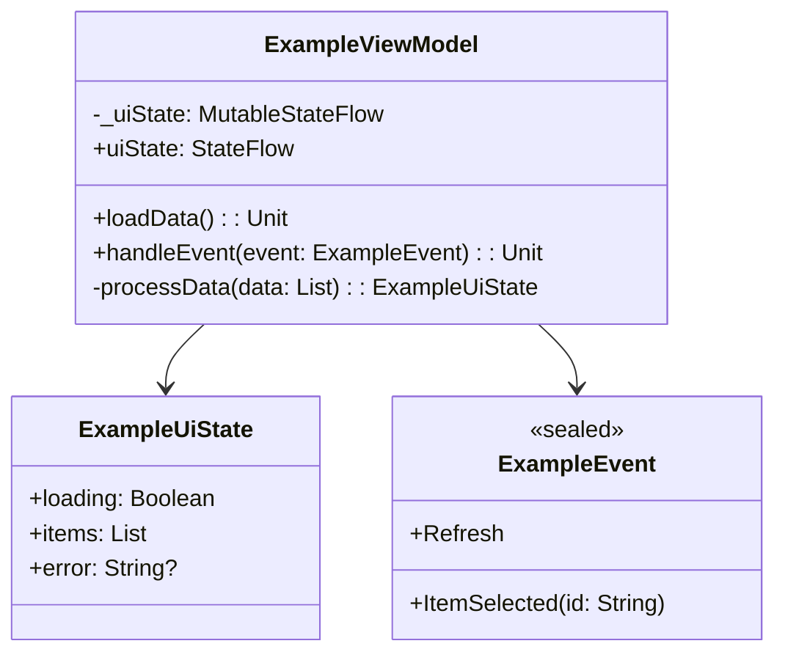
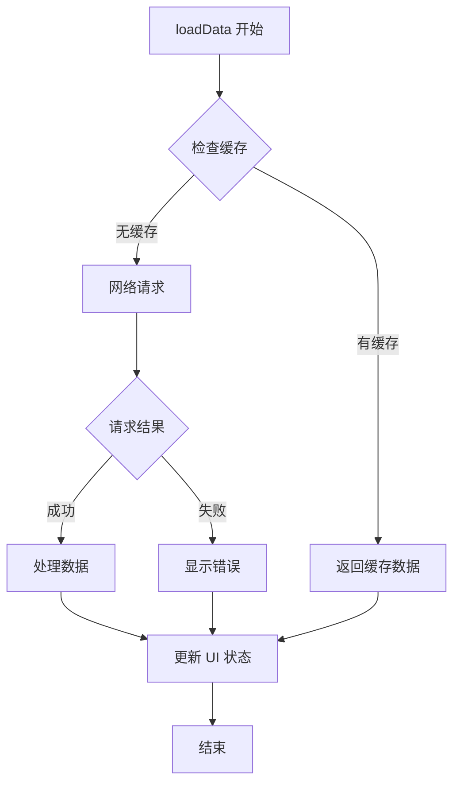

# `ExampleViewModel.kt` 代码分析

## 1. 文件基本信息

- **文件名称**：`ExampleViewModel.kt`
- **文件路径**：`app/src/main/java/com/example/myapp/ui/example/ExampleViewModel.kt`
- **主要功能**：管理示例屏幕的 UI 状态和用户交互，处理数据加载和状态转换
- **技术要点**：ViewModel、StateFlow、协程、依赖注入

## 2. 分层架构分析

### 2.1 界面层（UI Layer）

此文件作为 UI 层与业务层之间的桥梁，主要负责为 `ExampleScreen.kt` 提供状态数据

- **组件结构**：

  ```plaintext
  ExampleScreen/                       # 示例屏幕主容器
  ├── TopAppBar/                       # 顶部应用栏
  │   ├── Title                        # 标题文本
  │   └── ActionButtons                # 操作按钮组
  ├── ContentSection/                  # 内容区域
  │   ├── LoadingIndicator            # 加载指示器
  │   ├── ItemsList/                   # 项目列表
  │   │   ├── ItemCard                 # 单个项目卡片
  │   │   └── ItemDetails              # 项目详情内容
  │   └── EmptyState                   # 空数据状态提示
  └── BottomActions/                   # 底部操作区
      ├── PrimaryButton                # 主要操作按钮
      └── SecondaryButton              # 次要操作按钮
  ```

### 2.2 业务层（Domain Layer）

- **业务流程**：

    ```mermaid
    graph LR
        A[用户操作] --> B[ViewModel 处理]
        B --> C[调用 UseCase]
        C --> D[获取数据]
        D --> E[转换数据模型]
        E --> F[更新 UI 状态]
        F --> G[界面重组]
    ```

- **ViewModel 分析**：
  - 使用 StateFlow 管理 UI 状态
  - 通过依赖注入获取必要的 UseCase
  - 使用 viewModelScope 管理协程生命周期

### 2.3 数据层（Data Layer）

- **数据结构**：

    ```mermaid
    graph TD
        A[ExampleViewModel] --> B[ExampleUseCase]
        B --> C[ExampleRepository]
        C --> D[RemoteDataSource]
        C --> E[LocalDataSource]
    ```

## 3. 代码质量分析

- **设计模式**：
  - 观察者模式：通过 StateFlow 实现状态观察
  - 仓库模式：封装数据来源
  - 单例模式：通过依赖注入提供单例实例

- **Kotlin 特性**：
  - 使用扩展函数简化数据转换
  - 利用密封类表示有限状态集合
  - 使用 let、also、apply 等范围函数简化代码

## 4. UML 类图



## 5. 业务函数流程图



## 6. API 使用分析

- **重要 API**：

    | API 名称 | 用途 | 文档链接 |
    |---------|------|---------|
    | StateFlow | 管理响应式 UI 状态 | [StateFlow 文档](https://kotlin.github.io/kotlinx.coroutines/kotlinx-coroutines-core/kotlinx.coroutines.flow/-state-flow/) |
    | viewModelScope | 管理 ViewModel 协程生命周期 | [ViewModel KTX 文档](https://developer.android.com/kotlin/ktx#viewmodel) |
    | Hilt | 依赖注入 | [Hilt 文档](https://developer.android.com/training/dependency-injection/hilt-android) |

## 7. 注意事项与最佳实践

- **优点**：
  - 清晰的状态管理和数据流向
  - 良好的错误处理和加载状态展示
  - 充分利用 Kotlin 特性简化代码

- **改进空间**：
  - 可以添加单元测试提高代码质量
  - 考虑使用 SavedStateHandle 保存状态
  - 进一步优化协程使用方式
