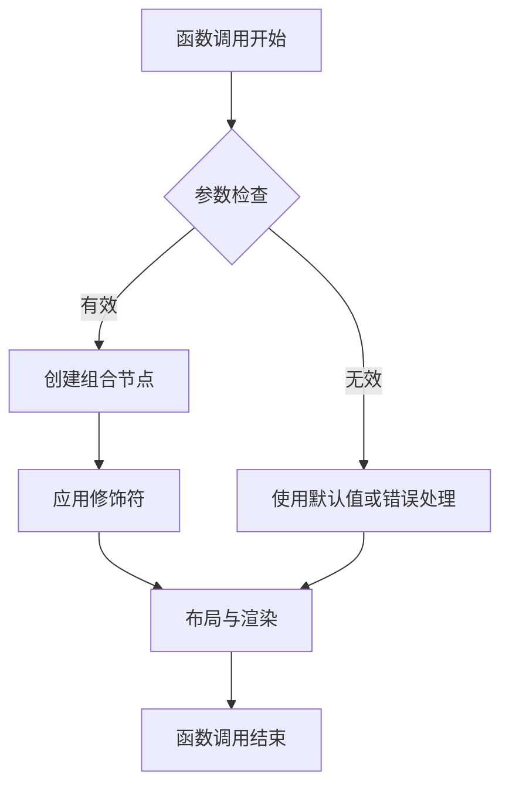
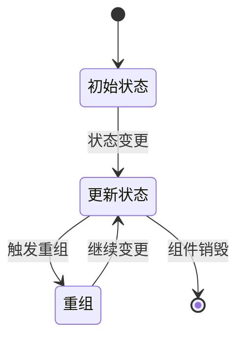
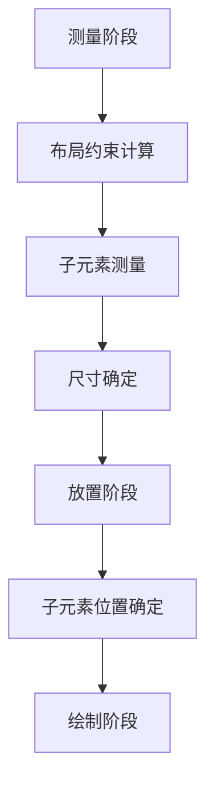
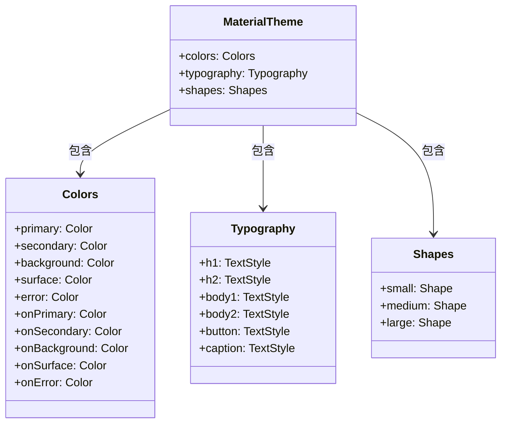
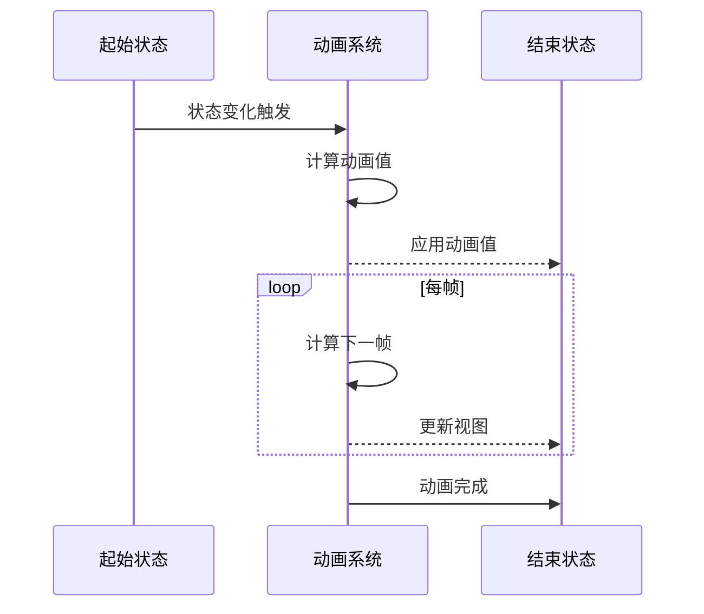
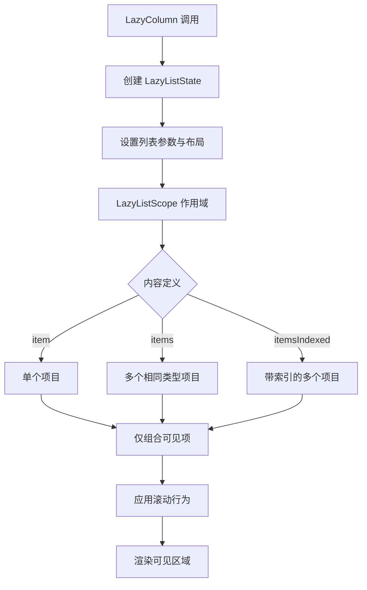

# Jetpack Compose API 讲解提示词

## 分析要求

请根据以下要求对指定的 Jetpack Compose API 进行全面分析与讲解：

### 1. API 基本信息

- **API 名称**：提供完整名称，包括包名
- **API 类型**：明确 API 为 Composable 函数、组合函数、状态相关 API、布局组件、主题组件、动画 API 或其他类型
- **所属模块/库**：说明 API 所属的库或框架（如 Compose Foundation、Compose Material、Compose Animation 等）
- **API 版本**：指明首次引入的 Compose 版本和当前最新版本
- **官方文档链接**：提供官方参考文档链接

### 2. API 详细解析

#### 2.1 Composable 函数解析

- **函数签名**：完整展示函数签名，包括修饰符、参数和返回类型
- **核心功能**：详细说明函数的主要功能和设计目的
- **使用场景**：列举该函数的典型应用场景和使用条件
- **参数说明**：
  - 逐一解析每个参数的用途、数据类型和默认值
  - 特别说明 `modifier` 参数的作用和推荐用法
  - 说明回调函数参数的触发时机和预期行为
- **组合规则**：
  - 说明组合过程中的重组条件和优化策略
  - 分析 `key`、`remember`、`derivedStateOf` 等与重组相关的使用
- **槽位（Slot）API**：如果函数提供内容槽位，说明其用法和约束
- **源码分析**：简要分析函数内部实现原理，重点关注核心逻辑
- **组件视图**：使用示意图表示组件的视觉结构（可使用 ASCII 图或简单示意图）
- **组合流程图**：使用 Mermaid 语法绘制函数的组合流程图



#### 2.2 状态相关 API 解析

- **设计目的**：说明 API 的设计意图和状态管理原则
- **状态行为**：详细描述状态的生命周期、变化机制和作用范围
- **状态类型**：说明 API 适用的状态类型（如可变状态、派生状态、共享状态）
- **重组行为**：解析状态变化如何触发重组及其优化机制
- **使用场景**：列举适合使用该状态 API 的典型场景
- **状态流转图**：使用 Mermaid 语法绘制状态流转图，展示状态变化的流程和触发条件



#### 2.3 修饰符（Modifier）解析

- **修饰符类型**：说明修饰符的类型和分类（如布局修饰符、绘制修饰符、行为修饰符等）
- **功能描述**：详细说明修饰符的核心功能和效果
- **参数说明**：逐一解析修饰符函数的参数和作用
- **顺序影响**：分析修饰符链中的顺序对最终效果的影响
- **修饰符组合**：说明与其他修饰符组合使用的效果和建议
- **示例代码**：提供典型使用示例
- **修饰符效果图**：如可能，使用简单示意图展示修饰符的视觉效果

#### 2.4 布局组件解析

- **布局算法**：说明布局组件的测量和放置算法
- **布局约束**：解析组件处理父级约束和传递子级约束的机制
- **子元素处理**：说明组件如何排列和定位子元素
- **自定义参数**：解析布局特有的参数（如排列方式、间距、对齐方式等）
- **性能特性**：分析布局组件的性能特点和优化方向
- **布局示意图**：使用 Mermaid 或其他方式展示布局示意图



#### 2.5 主题与样式解析

- **主题组成**：说明主题组件的构成元素和层次结构
- **颜色系统**：解析颜色定义和使用方式
- **排版样式**：说明文字样式的定义和应用
- **形状定义**：解析形状系统的使用方法
- **主题继承**：说明如何继承和覆盖默认主题
- **暗色主题**：解析暗色主题的特殊处理
- **主题结构图**：使用 Mermaid 语法绘制主题结构图



#### 2.6 动画 API 解析

- **动画类型**：说明动画的类型（如属性动画、过渡动画、关键帧动画等）
- **动画参数**：解析动画的持续时间、缓动函数、重复模式等参数
- **状态变化**：说明动画如何响应状态变化
- **动画组合**：解析多个动画的组合方式
- **动画控制**：说明动画的启动、暂停、恢复和取消方法
- **性能影响**：分析动画对性能的影响和优化方法
- **动画时序图**：使用 Mermaid 语法绘制动画时序图



### 3. 代码示例

- **基础用法**：提供简单的基础用法示例
- **进阶用法**：展示更复杂的应用场景
- **自定义扩展**：演示如何基于该 API 进行自定义扩展
- **与状态管理结合**：展示与各种状态管理方式的结合使用
- **最佳实践**：提供符合 Compose 设计理念的最佳实践示例
- **常见错误**：列举使用该 API 时的常见错误和避免方法
- **兼容性处理**：如需要，提供不同 Compose 版本的兼容性处理示例

### 4. 性能与优化

- **重组优化**：分析 API 在重组过程中的性能特点和优化方法
- **稳定性影响**：说明 API 参数的稳定性如何影响重组
- **记忆化策略**：提供适用于该 API 的记忆化策略
- **延迟加载**：说明如何实现延迟加载以提高性能
- **渲染优化**：分析绘制和渲染相关的性能优化
- **最佳实践**：提供性能优化相关的最佳实践

### 5. 组合上下文和副作用

- **组合上下文**：说明 API 在组合过程中的上下文要求和限制
- **副作用管理**：分析 API 相关的副作用处理（使用 `LaunchedEffect`、`DisposableEffect` 等）
- **生命周期关联**：说明 API 与组件生命周期的关联方式
- **状态提升**：解析何时以及如何进行状态提升
- **重组范围**：分析 API 的重组范围和边界
- **上下文收集**：说明如何使用 `CompositionLocal` 进行上下文收集和传递

### 6. 可访问性与国际化

- **可访问性支持**：说明 API 提供的可访问性功能和最佳实践
- **语义属性**：解析 API 的语义树结构和语义属性设置
- **国际化支持**：说明如何处理不同语言和区域的适配
- **RTL 支持**：分析对从右到左布局的支持情况
- **屏幕阅读器**：说明与屏幕阅读器的兼容性和优化方法
- **高对比度**：解析高对比度模式下的显示效果

### 7. 版本兼容性

- **API 变化**：说明不同 Compose 版本中 API 的变化
- **废弃信息**：如果 API 被废弃，提供替代方案
- **向后兼容**：提供保持向后兼容的策略
- **实验性 API**：标注实验性 API 的稳定性和使用风险

### 8. 相关 API

- **协作 API**：列出常与该 API 一起使用的其他 Compose API
- **替代方案**：提供可能的替代 API 和比较分析
- **迁移路径**：如果是替代传统 View 系统的 API，提供从 View 到 Compose 的迁移建议

### 9. 与 Compose 架构的关系

- **声明式 UI**：说明 API 如何体现 Compose 的声明式设计理念
- **单向数据流**：分析 API 在单向数据流中的角色和最佳实践
- **状态下沉**：说明如何实现状态下沉模式
- **组合理念**：解析 API 与 Compose 组合理念的契合点
- **分层架构**：说明 API 在 Compose 分层架构中的位置

### 10. 测试策略

- **单元测试**：提供对该 API 进行单元测试的方法和示例
- **UI 测试**：说明如何在 UI 测试中验证 API 行为
- **测试约束**：解析测试中的特殊约束和注意事项
- **测试工具**：介绍适用于该 API 的测试工具和库
- **测试最佳实践**：提供测试相关的最佳实践

## 分析输出格式

- **语言**：使用简明、专业的中文进行讲解
- **格式**：使用 Markdown 格式，注意层级结构清晰
- **代码示例**：为 Kotlin 和 Compose 代码提供语法高亮
- **专业术语**：保持术语的专业准确性，首次出现时提供解释
- **排版规范**：严格遵循中文文案排版规范
  - 中英文之间需要增加空格
  - 中文与数字之间需要增加空格
  - 数字与单位之间需要增加空格
  - 行内代码与中文之间需要空格
  - 使用全角中文标点符号
  - 专有名词使用正确的大小写

## 输出示例

以下是针对某个 Jetpack Compose API 的解析输出示例片段：

```markdown
# LazyColumn 组件讲解

## 1. API 基本信息

- **API 名称**：`androidx.compose.foundation.lazy.LazyColumn`
- **API 类型**：Composable 函数
- **所属库**：Compose Foundation
- **API 版本**：首次引入于 Compose 1.0.0-alpha01，当前稳定版本已支持
- **官方文档**：[LazyColumn](https://developer.android.com/reference/kotlin/androidx/compose/foundation/lazy/package-summary#LazyColumn)

## 2. API 详细解析

### 2.1 核心功能

LazyColumn 是 Jetpack Compose 中用于高效显示垂直滚动列表的组件。它只会组合和布局当前可见的项目，从而在处理大型列表时实现高效的内存使用和性能表现。它是传统 RecyclerView 在 Compose 中的声明式替代品。

### 2.2 使用场景

- 显示长列表或无限列表，如聊天记录、推文列表、新闻提要等
- 需要垂直滚动的内容，且内容项数量较多或不确定
- 需要支持不同类型项目的列表
- 需要高效内存使用的垂直滚动布局

### 2.3 函数签名

```kotlin
@Composable
fun LazyColumn(
    modifier: Modifier = Modifier,
    state: LazyListState = rememberLazyListState(),
    contentPadding: PaddingValues = PaddingValues(0.dp),
    reverseLayout: Boolean = false,
    verticalArrangement: Arrangement.Vertical = 
        if (!reverseLayout) Arrangement.Top else Arrangement.Bottom,
    horizontalAlignment: Alignment.Horizontal = Alignment.Start,
    flingBehavior: FlingBehavior = ScrollableDefaults.flingBehavior(),
    userScrollEnabled: Boolean = true,
    content: LazyListScope.() -> Unit
)
```

### 2.4 参数说明

- **modifier**：应用于 LazyColumn 布局的修饰符，用于自定义外观和行为
- **state**：控制和观察列表状态的 LazyListState，包含滚动位置和其他状态信息
- **contentPadding**：应用于整个内容的内边距，常用于避免内容被系统栏遮挡
- **reverseLayout**：是否反转列表项的顺序并从底部开始布局
- **verticalArrangement**：列表项在垂直方向上的排列方式
- **horizontalAlignment**：列表项在水平方向上的对齐方式
- **flingBehavior**：定义快速滑动行为的对象
- **userScrollEnabled**：是否允许用户滚动列表
- **content**：定义列表内容的 lambda 表达式，使用 LazyListScope 作为接收者

### 2.5 组合流程



## 3. 代码示例

### 3.1 基础用法

```kotlin
@Composable
fun SimpleList() {
    LazyColumn {
        items(100) { index ->
            Text(
                text = "项目 #$index",
                modifier = Modifier
                    .fillMaxWidth()
                    .padding(16.dp)
            )
        }
    }
}
```

### 3.2 带状态控制的用法

```kotlin
@Composable
fun ListWithStateControl() {
    val listState = rememberLazyListState()
    val coroutineScope = rememberCoroutineScope()
    
    Column {
        Row(
            modifier = Modifier
                .fillMaxWidth()
                .padding(8.dp),
            horizontalArrangement = Arrangement.SpaceEvenly
        ) {
            Button(onClick = {
                coroutineScope.launch {
                    // 滚动到顶部
                    listState.animateScrollToItem(0)
                }
            }) {
                Text("顶部")
            }
            
            Button(onClick = {
                coroutineScope.launch {
                    // 滚动到底部
                    listState.animateScrollToItem(99)
                }
            }) {
                Text("底部")
            }
        }
        
        LazyColumn(state = listState) {
            items(100) { index ->
                Text(
                    text = "项目 #$index",
                    modifier = Modifier
                        .fillMaxWidth()
                        .padding(16.dp)
                )
            }
        }
    }
}
```

## 4. 性能与优化

### 4.1 重组优化

LazyColumn 内部实现了高效的项目重用机制，类似于 RecyclerView，它只会组合和布局可见的项目。为了获得最佳性能，应遵循以下原则：

- 使用稳定的数据模型避免不必要的重组
- 为列表项提供唯一且稳定的键，特别是在项目可能移动、添加或删除的情况下：

```kotlin
LazyColumn {
    items(
        items = dataList,
        key = { item -> item.id } // 提供稳定的键
    ) { item ->
        ListItem(item)
    }
}
```

### 4.2 记忆化策略

在列表项内部，应谨慎使用 `remember` 来避免状态在滚动过程中丢失。对于需要在滚动时保持的状态，应当提升状态或使用 `rememberSaveable`：

```kotlin
LazyColumn {
    items(items) { item ->
        var isExpanded by rememberSaveable { mutableStateOf(false) }
        ExpandableListItem(
            item = item,
            isExpanded = isExpanded,
            onToggleExpand = { isExpanded = !isExpanded }
        )
    }
}
```

## 7. 与 Compose 架构的关系

### 7.1 声明式 UI

LazyColumn 体现了 Compose 的声明式设计理念，开发者只需描述列表的内容和外观，而不需要手动管理视图的创建、回收和更新。这种声明式方法简化了列表的实现，减少了样板代码，并降低了错误发生的可能性。

与传统的命令式列表实现（如 RecyclerView）相比，LazyColumn 不需要：
- 创建和管理 ViewHolder
- 实现适配器
- 手动处理视图类型
- 显式调用 notifyDataSetChanged 或其他通知方法

### 7.2 单向数据流

LazyColumn 支持 Compose 的单向数据流模式，数据从上层组件流向列表项，事件从列表项流回上层组件。这种模式使数据流更可预测，便于调试和测试：

```kotlin
@Composable
fun TaskList(
    tasks: List<Task>,
    onTaskComplete: (Task) -> Unit
) {
    LazyColumn {
        items(tasks) { task ->
            TaskItem(
                task = task,
                onComplete = { onTaskComplete(task) }
            )
        }
    }
}
```

在这个例子中，任务列表和任务完成事件处理函数作为参数传递，体现了单向数据流的原则。
```

## 参考资料

- [Jetpack Compose 官方文档](https://developer.android.com/jetpack/compose)
- [Compose 布局基础](https://developer.android.com/jetpack/compose/layouts/basics)
- [Compose 状态管理](https://developer.android.com/jetpack/compose/state)
- [Compose 修饰符](https://developer.android.com/jetpack/compose/modifiers)
- [Compose 动画](https://developer.android.com/jetpack/compose/animation)
- [Compose 主题](https://developer.android.com/jetpack/compose/themes)
- [Compose 最佳实践](https://developer.android.com/jetpack/compose/performance/bestpractices) 