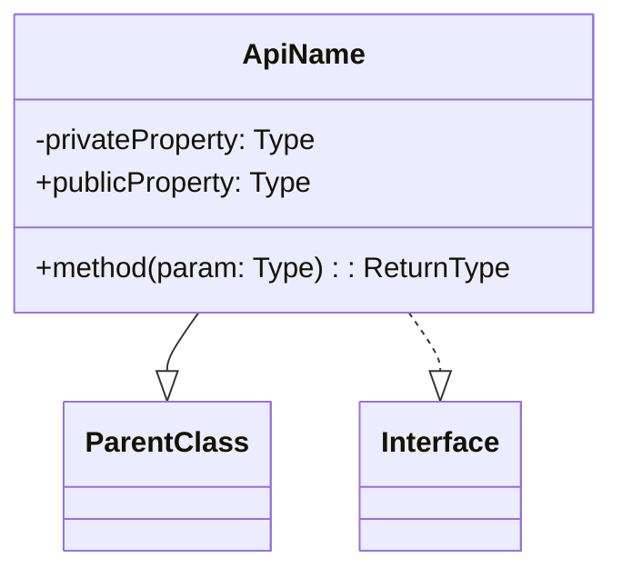
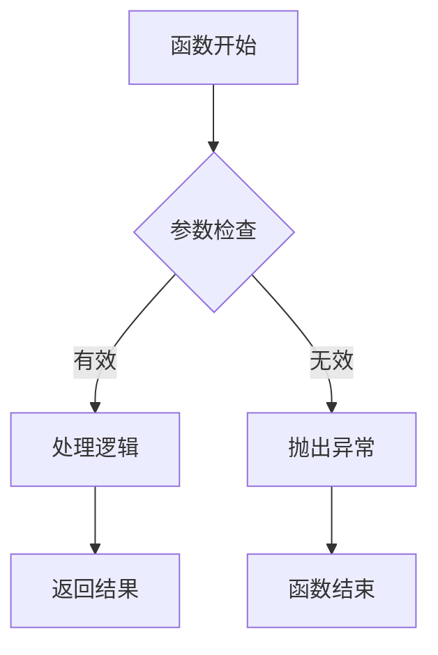
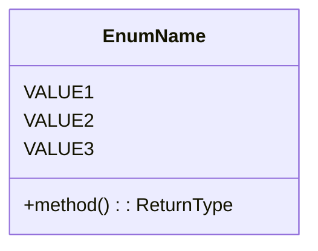
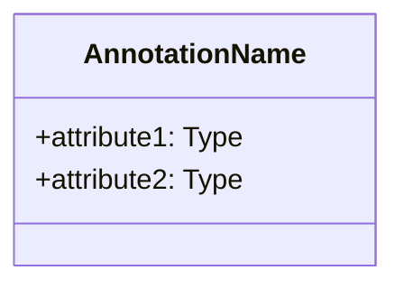
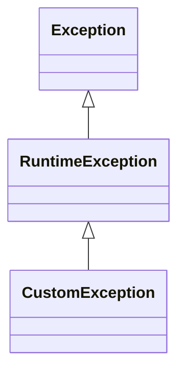

# Android 项目 Kotlin API 讲解提示词

## 分析要求

请根据以下要求对指定的 Android Kotlin API 进行全面分析与讲解：

### 1. API 基本信息

- **API 名称**：提供完整名称，包括包名
- **API 类型**：明确 API 为类、接口、函数、枚举、注解还是其他类型
- **所属模块/库**：说明 API 所属的库或框架（如 Android SDK、Jetpack、第三方库等）
- **API 版本**：指明首次引入的 API 级别和当前最新版本
- **官方文档链接**：提供官方参考文档链接

### 2. API 详细解析

#### 2.1 类（Class）解析

- **核心功能**：详细说明类的主要功能和设计目的
- **使用场景**：列举该类的典型应用场景和使用条件
- **继承关系**：说明类的父类和实现的接口
- **主要属性**：
  - 列出核心属性，说明其类型、可见性和用途
  - 区分只读属性与可变属性
  - 标注 `@Deprecated` 的属性
- **主要方法**：
  - 列出重要方法，说明参数、返回值和功能
  - 区分实例方法与伴生对象方法
  - 标注生命周期相关方法
  - 标注 `@Deprecated` 的方法
- **内部类/嵌套类**：说明重要的内部类及其用途
- **类图**：使用 Mermaid 语法绘制类的 UML 图，展示继承关系、主要属性和方法



#### 2.2 接口（Interface）解析

- **设计目的**：说明接口的设计意图和抽象原则
- **使用场景**：列举实现该接口的常见场景
- **抽象方法**：详细说明接口定义的抽象方法
- **默认方法**：解析接口提供的默认实现
- **属性**：说明接口定义的属性
- **接口图**：使用 Mermaid 语法绘制接口的 UML 图

#### 2.3 函数解析

- **函数签名**：完整展示函数签名，包括修饰符、参数和返回类型
- **功能描述**：详细说明函数的核心功能
- **参数说明**：逐一解析每个参数的用途、数据类型和默认值
- **返回值**：详细说明返回值的类型和含义
- **异常处理**：列出函数可能抛出的异常及触发条件
- **使用示例**：提供简洁的调用示例
- **流程图**：使用 Mermaid 语法绘制函数的执行流程图



#### 2.4 枚举（Enum）解析

- **用途说明**：解释枚举的设计意图
- **枚举值**：列出所有枚举值及其含义
- **方法**：说明枚举类中定义的方法
- **使用场景**：列举常见使用场景
- **枚举图**：使用 Mermaid 语法绘制枚举关系图



#### 2.5 注解（Annotation）解析

- **用途**：详细说明注解的用途和设计目的
- **元注解**：列出该注解上使用的元注解（如 `@Retention`, `@Target`）
- **属性**：解析注解的属性及其含义
- **使用场景**：说明典型使用场景
- **注解图**：使用 Mermaid 语法绘制注解结构图



#### 2.6 异常（Exception）解析

- **异常类型**：说明异常的类型和继承结构
- **触发条件**：详述导致该异常的典型情况
- **异常属性**：解析异常类中的属性
- **处理方法**：提供异常处理的最佳实践
- **异常图**：使用 Mermaid 语法绘制异常继承图



### 3. 代码示例

- **基础用法**：提供简单的基础用法示例
- **进阶用法**：展示更复杂的应用场景
- **最佳实践**：提供符合业界标准的最佳实践示例
- **常见错误**：列举使用该 API 时的常见错误和避免方法
- **兼容性处理**：如需要，提供不同 API 级别的兼容性处理示例

### 4. 性能与安全考虑

- **性能影响**：分析 API 可能对应用性能的影响
- **内存管理**：说明与内存管理相关的注意事项
- **线程安全性**：分析 API 的线程安全特性
- **安全最佳实践**：提供使用该 API 的安全最佳实践

### 5. 版本兼容性

- **行为变化**：说明不同 Android 版本中 API 的行为差异
- **废弃信息**：如果 API 被废弃，提供替代方案
- **向前兼容**：提供保持向前兼容的策略

### 6. 相关 API

- **协作 API**：列出常与该 API 一起使用的其他 API
- **替代方案**：提供可能的替代 API 和比较分析

## 分析输出格式

- **语言**：使用简明、专业的中文进行讲解
- **格式**：使用 Markdown 格式，注意层级结构清晰
- **代码示例**：为 Kotlin 代码提供语法高亮
- **专业术语**：保持术语的专业准确性，首次出现时提供解释
- **排版规范**：严格遵循中文文案排版规范
  - 中英文之间需要增加空格
  - 中文与数字之间需要增加空格
  - 数字与单位之间需要增加空格
  - 行内代码与中文之间需要空格
  - 使用全角中文标点符号
  - 专有名词使用正确的大小写

## 输出示例

以下是针对某个 Android Kotlin API 的解析输出示例片段：

```markdown
# RecyclerView 类讲解

## 1. API 基本信息

- **API 名称**：`androidx.recyclerview.widget.RecyclerView`
- **API 类型**：类
- **所属库**：AndroidX RecyclerView
- **API 级别**：首次引入于 Support Library 22.1.0，现已迁移至 AndroidX
- **官方文档**：[RecyclerView](https://developer.android.com/reference/androidx/recyclerview/widget/RecyclerView)

## 2. API 详细解析

### 2.1 核心功能

RecyclerView 是一个灵活的视图组件，用于高效显示大量数据集。它通过回收和复用视图holders来优化滚动性能，是 ListView 的更强大替代品。

### 2.2 使用场景

- 展示大型数据集合，如联系人列表、图片库、新闻提要等
- 需要自定义布局的列表或网格视图
- 需要支持动画效果的列表
- 需要在滚动时保持高性能的场景

### 2.3 主要组件关系

```mermaid
    classDiagram
        class RecyclerView {
            +setAdapter(adapter: Adapter): void
            +setLayoutManager(layout: LayoutManager): void
            +addItemDecoration(decor: ItemDecoration): void
            +scrollToPosition(position: int): void
            +smoothScrollToPosition(position: int): void
        }
        
        class Adapter {
            +onCreateViewHolder(parent: ViewGroup, viewType: int): ViewHolder
            +onBindViewHolder(holder: ViewHolder, position: int): void
            +getItemCount(): int
        }
        
        class ViewHolder {
            +itemView: View
            +getAdapterPosition(): int
        }
        
        class LayoutManager {
            +canScrollVertically(): boolean
            +canScrollHorizontally(): boolean
        }
        
        RecyclerView --> Adapter
        RecyclerView --> LayoutManager
        Adapter --> ViewHolder
    ```

    ## 3. 代码示例

    ### 3.1 基础用法

    ```kotlin
    // 在 Activity 或 Fragment 中设置 RecyclerView
    class MainActivity : AppCompatActivity() {
        override fun onCreate(savedInstanceState: Bundle?) {
            super.onCreate(savedInstanceState)
            setContentView(R.layout.activity_main)
            
            val recyclerView = findViewById<RecyclerView>(R.id.recycler_view)
            
            // 设置布局管理器
            recyclerView.layoutManager = LinearLayoutManager(this)
            
            // 设置适配器
            val dataList = listOf("Item 1", "Item 2", "Item 3")
            recyclerView.adapter = MyAdapter(dataList)
        }
    }

    // 创建适配器
    class MyAdapter(private val dataList: List<String>) : 
            RecyclerView.Adapter<MyAdapter.ViewHolder>() {
        
        class ViewHolder(view: View) : RecyclerView.ViewHolder(view) {
            val textView: TextView = view.findViewById(R.id.text_view)
        }
        
        override fun onCreateViewHolder(parent: ViewGroup, viewType: Int): ViewHolder {
            val view = LayoutInflater.from(parent.context)
                .inflate(R.layout.item_view, parent, false)
            return ViewHolder(view)
        }
        
        override fun onBindViewHolder(holder: ViewHolder, position: Int) {
            holder.textView.text = dataList[position]
        }
        
        override fun getItemCount() = dataList.size
    }
    ```
```
