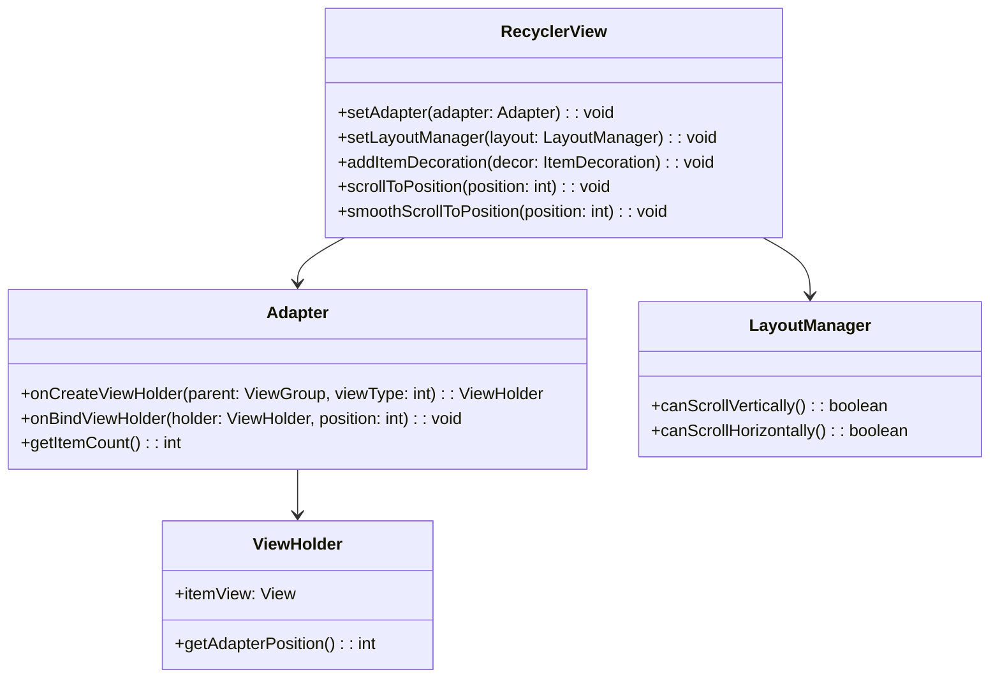

# RecyclerView 类讲解

## 1. API 基本信息

- **API 名称**：`androidx.recyclerview.widget.RecyclerView`
- **API 类型**：类
- **所属库**：AndroidX RecyclerView
- **API 级别**：首次引入于 Support Library 22.1.0，现已迁移至 AndroidX
- **官方文档**：[RecyclerView](https://developer.android.com/reference/androidx/recyclerview/widget/RecyclerView)

## 2. API 详细解析

### 2.1 核心功能

RecyclerView 是一个灵活的视图组件，用于高效显示大量数据集。它通过回收和复用视图holders来优化滚动性能，是 ListView 的更强大替代品。

### 2.2 使用场景

- 展示大型数据集合，如联系人列表、图片库、新闻提要等
- 需要自定义布局的列表或网格视图
- 需要支持动画效果的列表
- 需要在滚动时保持高性能的场景

### 2.3 主要组件关系



## 3. 代码示例

### 3.1 基础用法

```kotlin
// 在 Activity 或 Fragment 中设置 RecyclerView
class MainActivity : AppCompatActivity() {
    override fun onCreate(savedInstanceState: Bundle?) {
        super.onCreate(savedInstanceState)
        setContentView(R.layout.activity_main)
        
        val recyclerView = findViewById<RecyclerView>(R.id.recycler_view)
        
        // 设置布局管理器
        recyclerView.layoutManager = LinearLayoutManager(this)
        
        // 设置适配器
        val dataList = listOf("Item 1", "Item 2", "Item 3")
        recyclerView.adapter = MyAdapter(dataList)
    }
}

// 创建适配器
class MyAdapter(private val dataList: List<String>) : 
        RecyclerView.Adapter<MyAdapter.ViewHolder>() {
    
    class ViewHolder(view: View) : RecyclerView.ViewHolder(view) {
        val textView: TextView = view.findViewById(R.id.text_view)
    }
    
    override fun onCreateViewHolder(parent: ViewGroup, viewType: Int): ViewHolder {
        val view = LayoutInflater.from(parent.context)
            .inflate(R.layout.item_view, parent, false)
        return ViewHolder(view)
    }
    
    override fun onBindViewHolder(holder: ViewHolder, position: Int) {
        holder.textView.text = dataList[position]
    }
    
    override fun getItemCount() = dataList.size
}
```

## 7. 相关 Kotlin 语法知识

### 7.1 语法特性

RecyclerView 的 Kotlin 使用中涉及以下 Kotlin 特有语法：

- **类型推断**：在创建 `val recyclerView = findViewById<RecyclerView>(R.id.recycler_view)` 时，Kotlin 能够根据泛型参数自动推断变量类型。
- **函数简化**：`getItemCount() = dataList.size` 使用了 Kotlin 的单表达式函数简化语法，省略了 return 关键字和花括号。
- **属性访问语法**：`holder.textView.text = dataList[position]` 直接通过属性访问语法设置文本，而不是调用 setter 方法。
- **构造函数参数属性**：`MyAdapter(private val dataList: List<String>)` 在构造函数中直接声明并初始化私有属性。

### 7.2 语言特性

与 RecyclerView 结合使用相关的 Kotlin 语言特性：

- **空安全**：在处理 ViewHolder 中的视图引用时，使用了 Kotlin 的非空类型系统，确保 `textView` 在访问前已初始化。
- **智能类型转换**：在 `onCreateViewHolder` 方法中，返回的 ViewHolder 对象会被智能转换为正确的类型。
- **Lambda 表达式**：使用 Lambda 简化点击监听器等回调实现：

```kotlin
holder.itemView.setOnClickListener { 
    // 点击处理逻辑
    val position = holder.adapterPosition
    if (position != RecyclerView.NO_POSITION) {
        // 处理项目点击
    }
}
```

### 7.3 协程集成

RecyclerView 可以与 Kotlin 协程结合使用，优化数据加载和处理流程：

```kotlin
// 在 ViewModel 中使用协程加载数据
class MyViewModel : ViewModel() {
    private val _items = MutableStateFlow<List<Item>>(emptyList())
    val items: StateFlow<List<Item>> = _items
    
    fun loadItems() {
        viewModelScope.launch {
            // 在后台线程加载数据
            val result = withContext(Dispatchers.IO) {
                repository.getItems()
            }
            // 更新 UI 状态
            _items.value = result
        }
    }
}

// 在 Activity/Fragment 中收集流数据
lifecycleScope.launch {
    repeatOnLifecycle(Lifecycle.State.STARTED) {
        viewModel.items.collect { items ->
            adapter.submitList(items)
        }
    }
}
```

### 7.4 与 Java 互操作

在 Kotlin 与 Java 混合项目中使用 RecyclerView 的注意事项：

- **Java 代码调用**：从 Java 代码调用 Kotlin 编写的适配器时，需要注意 Kotlin 的空安全系统可能导致的类型不匹配。
- **扩展函数访问**：在 Java 中无法直接使用为 RecyclerView 定义的 Kotlin 扩展函数，需要通过生成的静态方法访问。
- **伴生对象**：RecyclerView.Adapter 中定义在伴生对象中的常量，在 Java 代码中需要通过 `Companion` 引用访问。
