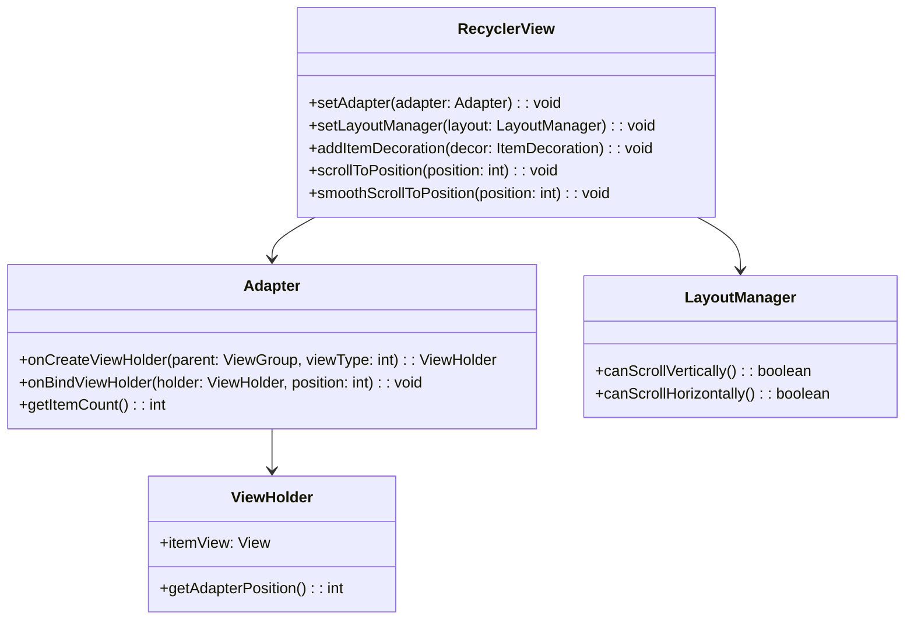

# RecyclerView 类讲解

## 1. API 基本信息

- **API 名称**：`androidx.recyclerview.widget.RecyclerView`
- **API 类型**：类
- **所属库**：AndroidX RecyclerView
- **API 级别**：首次引入于 Support Library 22.1.0，现已迁移至 AndroidX
- **官方文档**：[RecyclerView](https://developer.android.com/reference/androidx/recyclerview/widget/RecyclerView)

## 2. API 详细解析

### 2.1 核心功能

RecyclerView 是一个灵活的视图组件，用于高效显示大量数据集。它通过回收和复用视图holders来优化滚动性能，是 ListView 的更强大替代品。

### 2.2 使用场景

- 展示大型数据集合，如联系人列表、图片库、新闻提要等
- 需要自定义布局的列表或网格视图
- 需要支持动画效果的列表
- 需要在滚动时保持高性能的场景

### 2.3 主要组件关系



## 3. 代码示例

### 3.1 基础用法

```kotlin
// 在 Activity 或 Fragment 中设置 RecyclerView
class MainActivity : AppCompatActivity() {
    override fun onCreate(savedInstanceState: Bundle?) {
        super.onCreate(savedInstanceState)
        setContentView(R.layout.activity_main)
        
        val recyclerView = findViewById<RecyclerView>(R.id.recycler_view)
        
        // 设置布局管理器
        recyclerView.layoutManager = LinearLayoutManager(this)
        
        // 设置适配器
        val dataList = listOf("Item 1", "Item 2", "Item 3")
        recyclerView.adapter = MyAdapter(dataList)
    }
}

// 创建适配器
class MyAdapter(private val dataList: List<String>) : 
        RecyclerView.Adapter<MyAdapter.ViewHolder>() {
    
    class ViewHolder(view: View) : RecyclerView.ViewHolder(view) {
        val textView: TextView = view.findViewById(R.id.text_view)
    }
    
    override fun onCreateViewHolder(parent: ViewGroup, viewType: Int): ViewHolder {
        val view = LayoutInflater.from(parent.context)
            .inflate(R.layout.item_view, parent, false)
        return ViewHolder(view)
    }
    
    override fun onBindViewHolder(holder: ViewHolder, position: Int) {
        holder.textView.text = dataList[position]
    }
    
    override fun getItemCount() = dataList.size
}
```
