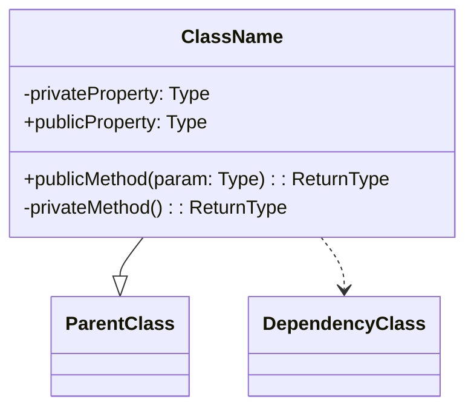
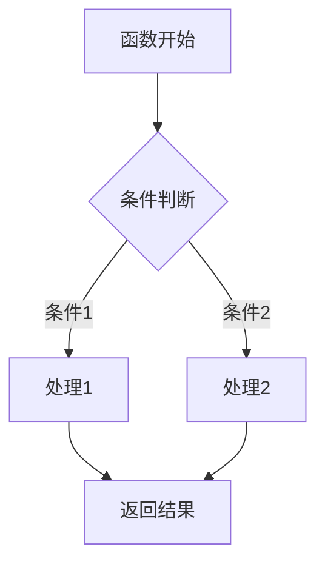

# Android Kotlin 代码文件分析 Prompt

## 项目技术栈

- Kotlin
- Jetpack Compose
- Gradle

## 分析要求

请根据以下要求对提供的 Android Kotlin 代码文件进行全面分析：

### 1. 文件基本信息

- **文件名称**：提供完整文件名
- **文件路径**：在项目中的相对路径
- **主要功能**：简要概述文件的核心功能和职责
- **技术要点**：列出文件中使用的关键技术点和特性

### 2. 分层架构分析

#### 2.1 界面层（UI Layer）

- **组件结构**：使用 ASCII 树形图展示 UI 组件结构

  ```plaintext
  ParentComponent/                  # 父组件说明
  ├── ChildComponent1/              # 子组件1说明
  │   ├── GrandchildComponent1.1/   # 孙组件1.1说明
  │   └── GrandchildComponent1.2/   # 孙组件1.2说明
  └── ChildComponent2/              # 子组件2说明
  ```

- **状态管理**：分析组件的状态管理方式（如 rememberSaveable、collectAsState、MutableState 等）
- **Compose 特性**：分析使用的特殊 Compose 特性（如 LaunchedEffect、rememberCoroutineScope、派生状态等）
- **组件交互**：说明组件间通信和事件处理机制

#### 2.2 业务层（Domain Layer）

- **业务流程**：使用 Mermaid 语法绘制业务流程图

  ```mermaid
  graph LR
      A[事件输入] --> B[业务处理]
      B --> C[状态更新]
      C --> D[UI 刷新]
  ```

- **ViewModel 分析**：详细说明 ViewModel 的职责、状态管理和事件处理
- **UseCase 分析**：分析业务用例实现
- **依赖注入**：说明依赖注入的实现方式和组件关系

#### 2.3 数据层（Data Layer）

- **数据结构**：使用 Mermaid 语法绘制数据关系图

  ```mermaid
  graph TD
      A[Repository] --> B[远程数据源]
      A --> C[本地数据源]
      B --> D[网络API]
      C --> E[数据库]
  ```

- **数据流向**：描述数据如何从源头流向 UI
- **数据转换**：分析数据模型间的映射和转换
- **持久化策略**：分析数据缓存和持久化实现

### 3. 代码质量分析

- **设计模式**：识别并说明代码中使用的设计模式
- **Kotlin 特性**：分析使用的 Kotlin 高级特性（如扩展函数、高阶函数、DSL 等）
- **异步处理**：分析协程和 Flow 的使用方式
- **性能考虑**：指出与性能相关的关键点（如 Compose 重组优化）

### 4. UML 类图

使用 Mermaid 语法绘制代码中关键类的 UML 类图：



### 5. 业务函数流程图

对关键业务函数使用 Mermaid 语法绘制详细流程图：



### 6. API 使用分析

- **重要 API**：列出代码文件中使用的重要 API

  | API 名称 | 用途 | 文档链接 |
  |---------|------|---------|
  | API 1   | 用途说明 | [链接](https://example.com) |
  | API 2   | 用途说明 | [链接](https://example.com) |

- **第三方库**：分析使用的第三方库及其用途

### 7. Compose 特定分析（如适用）

- **Composable 函数**：分析关键 Composable 函数的参数和返回结构
- **重组优化**：分析使用的记忆化策略（remember、derivedStateOf 等）
- **副作用处理**：分析副作用管理（LaunchedEffect、SideEffect 等）
- **主题与样式**：分析主题系统和样式处理

### 8. 注意事项与最佳实践

- **优点**：指出代码中值得学习的良好实践
- **改进空间**：提出可能的改进建议
- **风险点**：指出潜在的风险或问题

## 分析结果输出格式

分析结果应输出为一个 Markdown 文件，遵循以下规范：

1. 文件名称：`[原代码文件名].md`（不含扩展名）
2. 标题层级：使用合理的标题层级结构（#、##、### 等）
3. 代码块：使用 ``` 进行正确的代码块标记，并注明语言类型
4. 图表：使用 ASCII 字符画或 Mermaid 代码块创建流程图、类图等
5. 表格：使用 Markdown 标准表格语法
6. 链接：为 API 文档提供有效的链接
7. 排版：遵循中文文案排版规范，注意中英文间空格
