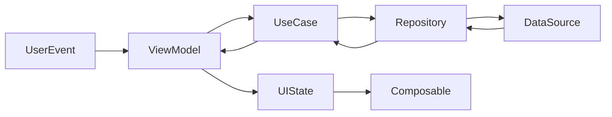
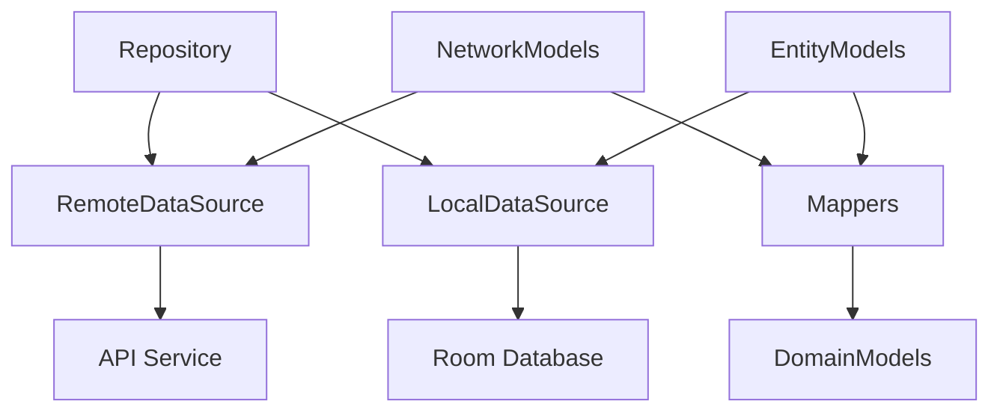

# Android 项目代码分析 Prompt：Kotlin + Jetpack Compose + Gradle

## 项目技术栈

- **任务**：识别并整理项目使用的核心技术栈。
- **分析要点**：
  - 确认项目使用的 Kotlin 版本及其特性应用（如扩展函数、高阶函数、委托属性等）。
  - 识别项目的 Gradle 构建配置和 Kotlin DSL 使用情况。
  - 明确区分 `gradle-wrapper.properties` 中 `distributionUrl` 指定的 Gradle 版本和 `libs.versions.toml` 或 `build.gradle` 中指定的 Android Gradle 插件版本。
  - 分析 Jetpack Compose 版本及其主要组件使用（Material3、Animation、Navigation 等）。
  - 确认项目架构模式（如 MVVM、MVI、Clean Architecture 等）及其与 Compose 的集成方式。
  - 识别 Kotlin 协程、Flow 和状态管理相关组件的使用模式。
  - 评估 Compose 性能优化措施（如记忆化、key 使用、LaunchedEffect 等）。
- **输出格式**：
  - 使用表格或列表形式列出主要技术栈组件。
  - 针对每个技术栈组件提供简要说明和项目中的应用方式。
  - 提供技术选型的优缺点分析（如适用）。

## 目录和文件结构

- **任务**：分析并整理 Android 项目的目录和文件结构。
- **输出格式**：
  - 使用 ASCII 树形图（类似命令行 `tree` 工具的输出）展示项目的目录结构。
  - **直接在树形图中**使用注释符号（`#`）在相应目录或文件后面添加简要说明，参考以下示例格式:

    ```plaintext
    app/
    ├── src/
    │   ├── androidTest/     # Android 测试代码
    │   │   └── java/
    │   │       └── com/example/myapp/
    │   │           └── ExampleTest.kt      # 主要测试用例
    ```

  - 特别关注 Kotlin 源文件组织方式和 Compose UI 相关文件的分布。
  - 分析 Compose 预览函数的使用和组织情况。
  - 检查 Gradle 模块化结构和依赖管理策略。
  - **注意**：忽略 `.gitignore` 文件中列出的目录和文件。

## 分层架构分析

### 1. 界面层（UI Layer）

- **任务**：分析项目的 Jetpack Compose 界面层结构和组件。
- **分析要点**：
  - 识别主要的 Composable 函数及其设计模式（如 Slot API、内容填充等）。
  - 分析 Compose 状态管理方式（rememberSaveable、collectAsState、MutableState 等）。
  - 辨识 Compose Navigation 实现和导航图构建方式。
  - 分析 Material3 主题设置和自定义设计系统实现。
  - 确认 Compose 组件的复用策略和自定义组件的抽象级别。
  - 检查状态提升（State Hoisting）和组件之间的状态共享实现方式。
  - 分析组件的记忆化（remember、derivedStateOf）使用和性能优化措施。
  - 评估 Compose 动画和过渡效果的实现方式。
- **输出格式**：
  - 使用 ASCII 树形图（类似命令行 `tree` 工具的输出）展示界面层的组件结构。
  - 对每个主要 Composable 组件的功能和关系进行简要说明。
  - 提供界面层与业务层的交互方式说明。
  - 分析组件之间的状态共享和传递方式。

### 2. 业务层（Domain Layer）

- **任务**：分析项目的业务逻辑实现。
- **分析要点**：
  - 识别主要的 ViewModel 类及其与 Compose 的集成方式。
  - 分析 Kotlin 协程和 Flow 在业务逻辑中的应用（如 viewModelScope、stateIn、sharedIn 等）。
  - 辨识事件处理和状态更新的流程，特别是单向数据流实现方式。
  - 分析依赖注入的实现方式（如 Hilt、Koin 等）与 Compose 的集成。
  - 评估业务逻辑的测试策略和可测试性设计。
- **输出格式**：
  - 使用 Mermaid 语法生成流程图，展示主要业务流程。
  - 对每个关键业务组件的职责进行简要说明。
  - 描述业务层与数据层的交互方式，特别是数据流的转换和处理。

### 3. 数据层（Data Layer）

- **任务**：分析项目的数据来源和处理方式。
- **分析要点**：
  - 识别主要的数据源（本地数据库、网络 API、文件存储等）。
  - 分析 Kotlin 序列化库（如 kotlinx.serialization）的应用。
  - 辨识 Kotlin 协程和 Flow 在数据处理中的应用（如 callbackFlow、flow 构建器等）。
  - 分析数据仓库（Repository）的实现方式和 Flow 转换操作。
  - 评估缓存策略和数据同步机制，特别是冷流和热流的使用。
- **输出格式**：
  - 使用 Mermaid 语法生成关系图，展示数据流动路径。
  - 对主要数据源和仓库的职责进行简要说明。
  - 描述数据模型与业务模型的映射关系。

## 第三方库信息

- **任务**：识别并整理项目中使用的第三方库。
- **输出格式**：
  - 列出每个第三方库的名称。
  - 简要说明每个第三方库的主要用途。
  - 提供每个第三方库的 GitHub 仓库链接（如果可用）。
  - 根据功能将第三方库分类（Compose UI 相关、网络请求、数据存储、工具类等）。
  - 特别关注 Compose 生态系统的库（如 Accompanist、Coil-Compose 等）。

## Gradle 构建系统分析

- **任务**：分析项目的 Gradle 构建配置和优化策略。
- **分析要点**：
  - 识别项目的 Gradle 版本和插件应用情况。
  - 分析 Kotlin DSL 的使用和自定义任务定义。
  - 检查依赖管理策略（如版本目录、依赖注入等）。
  - 评估构建性能优化措施（如并行构建、构建缓存等）。
  - 分析 Compose 编译器配置和优化选项。
  - 检查模块化架构和动态特性模块的配置。
- **输出格式**：
  - 列出关键的 Gradle 配置和自定义任务。
  - 分析构建变体和构建类型的配置。
  - 提供构建性能优化建议。

## 项目构建与运行命令

- **任务**：确认并列出项目构建、运行和打包的关键命令。
- **分析要点**：
  - 识别项目使用的 Gradle 构建命令和自定义任务。
  - 确认支持的最低 Android 版本和目标版本。
  - 识别构建变体（debug、release 等）和 Compose 相关的构建配置。
  - 分析 Compose 预览功能的使用方式和配置。
- **输出格式**：
  - 列出常用命令及其功能说明。
  - 提供每条命令的示例和可能需要的参数。
  - 说明命令执行可能遇到的常见问题及解决方案，特别是 Compose 相关问题。

## 示例输出格式

### 项目技术栈

| 类别 | 技术 | 版本 | 说明 |
|------|------|------|------|
| **编程语言** | Kotlin | 1.8.0+ | 项目主要使用 Kotlin 语言开发，利用其简洁语法和空安全特性 |
| **构建系统** | Gradle | 8.0+ | 使用 Gradle 作为构建工具，管理依赖和构建流程，版本信息位于 gradle-wrapper.properties 文件 |
| **Android 构建插件** | Android Gradle Plugin | 8.1.0+ | Android 特定构建插件，版本信息位于 libs.versions.toml 或 build.gradle 文件 |
| **构建脚本** | Kotlin DSL | - | 使用 Kotlin DSL 编写构建脚本，而非 Groovy |
| **UI 框架** | Jetpack Compose | 1.4.0+ | 使用声明式 UI 框架构建现代化界面 |
| **架构模式** | MVVM | - | 采用 Model-View-ViewModel 架构分离关注点 |
| **导航框架** | Jetpack Navigation | 2.5.0+ | 使用 Navigation 组件管理 Fragment 或 Compose 目标间的导航 |
| **异步处理** | Kotlin Coroutines | 1.6.0+ | 使用协程处理异步操作，替代传统回调 |
| **状态管理** | StateFlow/SharedFlow | - | 使用 Flow API 管理和传递 UI 状态 |
| **依赖注入** | Hilt | 2.44+ | 使用 Hilt 简化依赖注入实现 |
| **持久化存储** | Room | 2.5.0+ | 使用 Room 作为 SQLite 数据库抽象层 |
| **网络通信** | Retrofit | 2.9.0+ | 使用 Retrofit 处理 REST API 通信 |
| **JSON 解析** | Kotlinx Serialization | 1.5.0+ | 使用 Kotlin 原生序列化库解析 JSON |
| **图片加载** | Coil | 2.2.0+ | 使用专为 Compose 优化的图片加载库 |
| **单元测试** | JUnit | 4.13.2+ | 使用 JUnit 进行单元测试 |
| **UI 测试** | Compose Testing | - | 使用 Compose 特定测试工具进行 UI 测试 |

**技术栈特点**：

- 完全采用 Kotlin 现代特性，利用协程、Flow 和扩展函数简化代码。
- 采用声明式 UI 范式（Jetpack Compose），减少 UI 错误和提高开发效率。
- 遵循 Android 架构组件最佳实践，提高代码可维护性和可测试性。
- 使用响应式编程模式管理应用状态，实现单向数据流。

**注意事项**：

- Jetpack Compose 要求较高的 Kotlin 版本兼容性。
- Hilt 依赖注入会增加编译时间，但简化了运行时依赖管理。
- 完全理解响应式状态管理需要一定的学习曲线。

### 目录和文件结构

```plaintext
app/
├── src/
│   ├── androidTest/     # Android 测试代码
│   │   └── java/
│   │       └── com/
│   │           └── example/
│   │               └── myapp/
│   │                   └── ExampleInstrumentedTest.kt      # UI 自动化测试
│   ├── main/
│   │   ├── java/
│   │   │   └── com/
│   │   │       └── example/
│   │   │           └── myapp/
│   │   │               ├── MainActivity.kt                 # 应用主入口
│   │   │               ├── ui/                             # UI 相关代码
│   │   │               │   ├── components/                 # 可复用组件
│   │   │               │   │   ├── AppBar.kt              # 顶部应用栏
│   │   │               │   │   └── CommonUI.kt            # 通用 UI 元素
│   │   │               │   ├── screens/                    # 屏幕级组件
│   │   │               │   │   ├── HomeScreen.kt          # 首页屏幕
│   │   │               │   │   └── DetailScreen.kt        # 详情屏幕
│   │   │               │   └── theme/                      # 主题定义
│   │   │               │       ├── Color.kt               # 颜色定义
│   │   │               │       ├── Theme.kt               # 主题配置
│   │   │               │       └── Type.kt                # 字体排版
│   │   │               ├── domain/                         # 业务域相关代码
│   │   │               │   ├── model/                      # 业务模型
│   │   │               │   │   └── AppModels.kt           # 应用数据模型
│   │   │               │   ├── usecase/                    # 用例定义
│   │   │               │   │   └── AppUseCases.kt         # 业务用例实现
│   │   │               │   └── viewmodel/                  # 视图模型
│   │   │               │       ├── HomeViewModel.kt       # 首页视图模型
│   │   │               │       └── DetailViewModel.kt     # 详情视图模型
│   │   │               └── data/                           # 数据层代码
│   │   │                   ├── repository/                 # 仓库模式实现
│   │   │                   │   └── AppRepository.kt       # 应用数据仓库
│   │   │                   ├── source/                     # 数据源
│   │   │                   │   ├── local/                  # 本地数据源
│   │   │                   │   │   └── LocalDataSource.kt # 本地存储实现
│   │   │                   │   └── remote/                 # 远程数据源
│   │   │                   │       └── RemoteDataSource.kt # API 请求实现
│   │   │                   └── model/                      # 数据模型
│   │   │                       ├── ApiModels.kt           # API 响应模型
│   │   │                       └── DbModels.kt            # 数据库实体模型
│   │   ├── res/                                            # 资源文件
│   │   │   ├── drawable/                                   # 图像资源
│   │   │   ├── mipmap/                                     # 应用图标
│   │   │   ├── values/                                     # 值资源
│   │   │   │   ├── colors.xml                             # 颜色定义
│   │   │   │   ├── strings.xml                            # 字符串资源
│   │   │   │   └── themes.xml                             # XML 主题定义
│   │   │   └── navigation/                                 # 导航配置
│   │   │       └── nav_graph.xml                          # 导航图定义
│   │   └── AndroidManifest.xml                             # 应用清单
│   └── test/                                                # 单元测试
│       └── java/
│           └── com/
│               └── example/
│                   └── myapp/
│                       └── ExampleUnitTest.kt              # 单元测试示例
├── build.gradle.kts                                         # 模块构建脚本
└── proguard-rules.pro                                       # 混淆规则
```

**注意**：以上只是示例结构，实际项目结构可能有所不同。请根据实际项目进行分析和整理。

### 界面层组件结构

```plaintext
MainActivity
├── AppScaffold                    # 应用基础脚手架
│   ├── AppTopBar                  # 顶部工具栏
│   └── NavHost                    # 导航宿主
│       ├── HomeScreen             # 主页屏幕
│       │   ├── HeaderSection      # 顶部标题区域
│       │   ├── ContentList        # 内容列表区域
│       │   │   └── ContentItem    # 单个内容项
│       │   └── BottomActions      # 底部操作按钮
│       └── DetailScreen           # 详情屏幕
│           ├── DetailHeader       # 详情页头部
│           ├── DetailContent      # 详情页内容
│           └── ActionButtons      # 操作按钮组
└── AppDrawer                      # 应用抽屉菜单
```

**说明**：

- `MainActivity`：应用的主活动，通常是程序入口点。
- `AppScaffold`：应用的基础脚手架组件，提供基本布局结构。
- `NavHost`：导航宿主，负责管理不同屏幕之间的导航。
- `HomeScreen`：主页屏幕，通常是应用的首页。
- `DetailScreen`：详情屏幕，用于显示项目的详细信息。

### 业务层流程图



**说明**：

- 用户事件触发 ViewModel 中的方法。
- ViewModel 调用相应的 UseCase 执行业务逻辑。
- UseCase 通过 Repository 访问数据。
- 数据处理完成后，更新 UI 状态，触发界面重组。

### 数据层关系图



**说明**：

- `Repository`：统一管理数据来源，提供给业务层使用。
- `RemoteDataSource`：远程数据源，负责网络请求。
- `LocalDataSource`：本地数据源，负责数据库操作。
- `Mappers`：数据模型转换器，负责不同层次数据模型的转换。

### 第三方库信息

| 类别 | 库名 | 用途 | GitHub 仓库 |
|------|------|------|-------------|
| **UI 相关** | Compose Material3 | Material Design 3 组件库 | [https://github.com/androidx/androidx](https://github.com/androidx/androidx) |
| **UI 相关** | Coil | Jetpack Compose 图片加载库 | [https://github.com/coil-kt/coil](https://github.com/coil-kt/coil) |
| **网络请求** | Retrofit | 网络请求库 | [https://github.com/square/retrofit](https://github.com/square/retrofit) |
| **网络请求** | OkHttp | HTTP 客户端 | [https://github.com/square/okhttp](https://github.com/square/okhttp) |
| **数据存储** | Room | SQLite 数据库抽象层 | [https://github.com/androidx/androidx](https://github.com/androidx/androidx) |
| **依赖注入** | Hilt | 依赖注入库 | [https://github.com/google/dagger](https://github.com/google/dagger) |
| **异步处理** | Kotlin Coroutines | 协程库 | [https://github.com/Kotlin/kotlinx.coroutines](https://github.com/Kotlin/kotlinx.coroutines) |
| **状态管理** | StateFlow | 响应式编程 | [https://github.com/Kotlin/kotlinx.coroutines](https://github.com/Kotlin/kotlinx.coroutines) |

### 项目构建与运行命令

#### 构建项目

```bash
# 清理并构建项目
./gradlew clean build

# 只构建 Debug 版本
./gradlew assembleDebug

# 只构建 Release 版本
./gradlew assembleRelease

# 运行所有测试
./gradlew test

# 运行特定模块的测试
./gradlew :app:test
```

#### 运行到模拟器/设备

```bash
# 安装并运行 Debug 版本到默认模拟器/连接的设备
./gradlew installDebug

# 列出所有可用的模拟器
adb devices

# 运行到指定模拟器（假设有多个模拟器/设备连接）
./gradlew installDebug -PtargetDeviceId=emulator-5554

# 使用 Android Studio 直接运行（GUI 方式）
点击 Android Studio 顶部的运行按钮（▶）
```

#### 打包 APK

```bash
# 生成签名的 Release APK
./gradlew assembleRelease

# 生成未签名的 Debug APK
./gradlew assembleDebug

# 打包并签名（自定义签名配置）
./gradlew assembleRelease -Pandroid.injected.signing.store.file=/path/to/keystore.jks -Pandroid.injected.signing.store.password=storePassword -Pandroid.injected.signing.key.alias=keyAlias -Pandroid.injected.signing.key.password=keyPassword

# 生成 Android App Bundle (AAB)
./gradlew bundleRelease
```

#### 常见问题解决

- 如果遇到 SDK 许可问题，运行: `yes | sdkmanager --licenses`
- 如果 Gradle 同步失败，尝试: `./gradlew --refresh-dependencies`
- 如果构建失败，查看具体错误并检查: `./gradlew --stacktrace`
- 内存不足错误，在 gradle.properties 中添加: `org.gradle.jvmargs=-Xmx2048m`

**说明**：

- 所有命令都假设在项目根目录下执行。
- Windows 系统中使用 `gradlew.bat` 替代 `./gradlew`。
- 对于 CI/CD 环境，可添加 `--no-daemon` 标志以避免守护进程问题。
- 部分命令可能需要根据项目具体配置调整。

通过以上优化，提示词更加清晰、具体，便于生成准确且有用的输出，尤其适合分析 Kotlin 和 Jetpack Compose 构建的 Android 项目。

## 分析结果输出要求

- **任务**：将分析结果整理为标准化文档。
- **输出格式**：
  - 将所有分析结果写入一个新的 Markdown 文件，命名为 `project_analysis.md`。
  - 将文件保存在项目根目录。
  - 文档须遵循严格的 Markdown 规范和中文排版规范。
  - 文档应包含清晰的标题层级、格式统一的列表和适当的代码块标注。
- **格式规范**：
  - 遵循 [Markdown Lint 规则](https://raw.githubusercontent.com/hyh19/ai/refs/heads/master/cursor-rules/markdown-lint.md) 描述的格式标准。
  - 遵循 [中文文案排版规范](https://raw.githubusercontent.com/hyh19/ai/refs/heads/master/cursor-rules/chinese-typography.md) 进行中英文混排。
  - 正确处理中英文之间的空格、标点符号使用和代码与文本混排。
- **参考资料**：
  - Markdown Lint 规则: [https://raw.githubusercontent.com/hyh19/ai/refs/heads/master/cursor-rules/markdown-lint.md](https://raw.githubusercontent.com/hyh19/ai/refs/heads/master/cursor-rules/markdown-lint.md)
  - 中文文案排版规范: [https://raw.githubusercontent.com/hyh19/ai/refs/heads/master/cursor-rules/chinese-typography.md](https://raw.githubusercontent.com/hyh19/ai/refs/heads/master/cursor-rules/chinese-typography.md)
