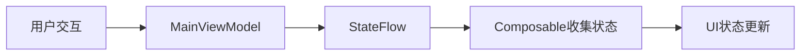
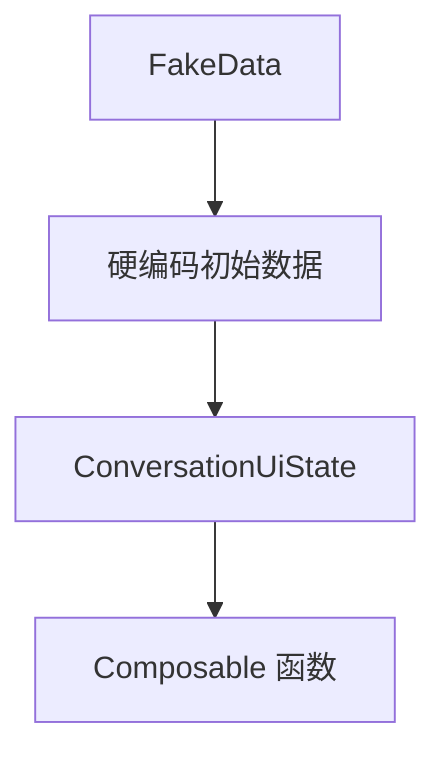

# Jetchat 项目分析报告

## 项目技术栈

| 类别 | 技术 | 版本 | 说明 |
|------|------|------|------|
| **编程语言** | Kotlin | 2.1.10 | 项目完全使用 Kotlin 开发，利用其空安全特性、扩展函数等现代特性 |
| **构建系统** | Gradle | 8.10.2 | 使用 Gradle 管理构建流程和依赖，版本信息位于 gradle-wrapper.properties |
| **Android 构建插件** | Android Gradle Plugin | 8.8.1 | Android 特定构建插件，版本信息位于 libs.versions.toml |
| **构建脚本** | Kotlin DSL | - | 使用 Kotlin DSL (.kts) 编写构建脚本，替代传统 Groovy |
| **UI 框架** | Jetpack Compose | 2025.02.00 (BOM) | 使用声明式 UI 框架构建现代化界面 |
| **架构模式** | MVVM | - | 采用 Model-View-ViewModel 架构分离关注点 |
| **导航框架** | Jetpack Navigation | 2.8.7 | 使用 Navigation 组件管理导航，结合传统 Fragment 和 Compose |
| **异步处理** | Kotlin Coroutines | 1.10.1 | 使用协程处理异步操作，替代传统回调 |
| **状态管理** | StateFlow | - | 使用 Flow API 管理和传递 UI 状态 |
| **Material 设计** | Material 3 | - | 采用 Material 3 设计规范构建 UI |
| **小组件** | Glance | 1.1.1 | 通过 Glance 创建应用小组件 |

**技术栈特点**：

- 完全采用 Kotlin 现代特性，利用协程、Flow 和扩展函数简化代码
- 采用声明式 UI 范式（Jetpack Compose），减少 UI 错误和提高开发效率
- 结合 Fragment 和 Compose 的混合架构，展示如何在现有 XML 布局的应用中集成 Compose
- 使用响应式编程模式管理应用状态，实现单向数据流

## 目录和文件结构

```
Jetchat/                                         # 项目根目录
├── app/                                         # 应用主模块
│   ├── src/                                     # 源代码目录
│   │   ├── androidTest/                         # Android 测试代码
│   │   │   └── java/com/example/compose/jetchat/# 测试包结构
│   │   │       ├── ConversationTest.kt          # 会话界面测试
│   │   │       ├── NavigationTest.kt            # 导航功能测试
│   │   │       └── UserInputTest.kt             # 用户输入测试
│   │   ├── main/                                # 主要源代码
│   │   │   ├── java/                            # Kotlin 源码
│   │   │   │   └── com/example/compose/jetchat/ # 包结构
│   │   │   │       ├── MainViewModel.kt         # 主要视图模型
│   │   │   │       ├── NavActivity.kt           # 主活动，应用入口
│   │   │   │       ├── UiExtras.kt              # UI 工具类
│   │   │   │       ├── components/              # 可复用组件
│   │   │   │       │   └── JetchatDrawer.kt     # 应用抽屉组件
│   │   │   │       ├── conversation/            # 会话相关组件
│   │   │   │       │   ├── Conversation.kt      # 会话主界面
│   │   │   │       │   ├── ConversationFragment.kt # 会话 Fragment
│   │   │   │       │   ├── ConversationUiState.kt # 会话 UI 状态
│   │   │   │       │   ├── JumpToBottom.kt      # 跳转到底部按钮
│   │   │   │       │   ├── MessageFormatter.kt  # 消息格式化工具
│   │   │   │       │   ├── RecordButton.kt      # 录音按钮
│   │   │   │       │   └── UserInput.kt         # 用户输入组件
│   │   │   │       ├── data/                    # 数据层代码
│   │   │   │       │   └── FakeData.kt          # 模拟数据
│   │   │   │       ├── profile/                 # 个人资料相关组件
│   │   │   │       │   ├── Profile.kt           # 个人资料界面
│   │   │   │       │   ├── ProfileFragment.kt   # 个人资料 Fragment
│   │   │   │       │   └── ProfileScreenState.kt# 个人资料状态
│   │   │   │       ├── theme/                   # 主题定义
│   │   │   │       │   ├── Color.kt             # 颜色定义
│   │   │   │       │   ├── Shape.kt             # 形状定义
│   │   │   │       │   ├── Theme.kt             # 主题配置
│   │   │   │       │   └── Typography.kt        # 字体排版
│   │   │   │       └── widget/                  # 应用小组件
│   │   │   │           ├── JetChatWidget.kt     # Glance 小组件定义
│   │   │   │           ├── WidgetReceiver.kt    # 小组件接收器
│   │   │   │           ├── composables/         # 小组件可组合函数
│   │   │   │           └── theme/               # 小组件主题
│   │   │   ├── res/                             # 资源文件
│   │   │   │   ├── drawable/                    # 图像资源
│   │   │   │   ├── layout/                      # XML 布局文件
│   │   │   │   │   └── content_main.xml         # 主布局容器
│   │   │   │   ├── navigation/                  # 导航配置
│   │   │   │   │   └── mobile_navigation.xml    # 导航图定义
│   │   │   │   ├── values/                      # 值资源
│   │   │   │   │   ├── colors.xml               # 颜色定义
│   │   │   │   │   ├── strings.xml              # 字符串资源
│   │   │   │   │   └── themes.xml               # XML 主题定义
│   │   │   │   └── xml/                         # XML 配置
│   │   │   │       └── widget_unread_messages_info.xml # 小组件信息
│   │   │   └── AndroidManifest.xml              # 应用清单
│   │   └── test/                                # 单元测试
│   ├── build.gradle.kts                         # 模块构建脚本
│   └── proguard-rules.pro                       # 混淆规则
├── gradle/                                      # Gradle 包装器
│   ├── libs.versions.toml                       # 版本目录（依赖版本管理）
│   └── wrapper/                                 # Gradle 包装器配置
│       ├── gradle-wrapper.jar                   # Gradle 包装器 JAR
│       └── gradle-wrapper.properties            # Gradle 版本配置
├── build.gradle.kts                             # 项目级构建脚本
├── gradle.properties                            # Gradle 属性配置
├── settings.gradle.kts                          # 项目设置脚本
└── README.md                                    # 项目说明文档
```

## 分层架构分析

### 1. 界面层（UI Layer）

```
NavActivity                                  # 应用主活动，程序入口点
├── ComposeView                              # Compose 视图容器
│   └── JetchatDrawer                        # 应用抽屉组件
│       ├── 抽屉状态管理                       # 通过 rememberDrawerState 管理抽屉状态
│       └── AndroidViewBinding                # XML 与 Compose 集成点
│           └── ContentMainBinding            # XML 布局引用
│               └── NavHostFragment           # 导航宿主 Fragment
│                   ├── ConversationFragment  # 会话 Fragment
│                   │   └── ConversationContent # 会话内容 Composable
│                   │       ├── ConversationHeader # 会话头部，显示频道信息
│                   │       ├── Messages          # 消息列表
│                   │       │   └── Message       # 单条消息项
│                   │       └── UserInput         # 用户输入区域
│                   │           ├── UserInputText  # 文本输入框
│                   │           └── RecordButton   # 录音按钮
│                   └── ProfileFragment      # 个人资料 Fragment
│                       └── ProfileScreen    # 个人资料屏幕
│                           ├── ProfileHeader # 个人资料头部
│                           └── ProfileContent # 个人资料内容
└── GlanceAppWidget                          # Glance 应用小组件
    └── MessagesWidget                       # 未读消息小组件
```

**界面层特点**：

- **混合架构**：结合传统 Fragment 和现代 Compose UI，展示了渐进式迁移方式
- **状态管理**：使用 `remember`、`collectAsStateWithLifecycle` 管理组件状态
- **Material 3**：采用最新的 Material 3 设计语言和组件
- **响应式 UI**：通过状态变更自动触发 UI 重组
- **组合模式**：将 UI 分解为可重用的小型组件，如 `Message`、`UserInput` 等
- **插槽 API**：使用 Composable 函数参数传递内容

**状态提升与共享**：

- 视图状态（如 `ConversationUiState`）在 Composable 层次结构中向上提升
- 通过 ViewModel 跨组件共享状态
- 使用 `LaunchedEffect` 处理副作用和一次性事件

### 2. 业务层（Domain Layer）



**业务层特点**：

- **简单 ViewModel**：示例项目中的 ViewModel 较为简单，主要管理导航抽屉状态
- **单向数据流**：状态从 ViewModel 流向 UI，事件从 UI 流向 ViewModel
- **StateFlow**：使用 Kotlin Flow API 的 `MutableStateFlow` 管理可观察状态
- **状态收集**：使用 `collectAsStateWithLifecycle` 在 Composable 中收集 Flow
- **协程范围**：使用 `viewModelScope` 管理协程生命周期

### 3. 数据层（Data Layer）



**数据层特点**：

- **模拟数据源**：项目使用硬编码数据模拟后端服务
- **不可变数据模型**：使用 `@Immutable` 注解标记不可变数据类
- **状态容器**：`ConversationUiState` 和 `ProfileScreenState` 作为 UI 状态容器
- **数据修改**：通过 `MutableList` 的封装实现数据变更
- **无网络请求**：示例中未实现实际网络通信

## 第三方库信息

| 类别 | 库名 | 用途 | GitHub/链接 |
|------|------|------|-------------|
| **UI 框架** | Jetpack Compose | 声明式 UI 框架 | [androidx.compose](https://developer.android.com/jetpack/compose) |
| **UI 组件** | Compose Material 3 | Material 设计组件 | [compose.material3](https://developer.android.com/jetpack/androidx/releases/compose-material3) |
| **导航** | Compose Navigation | 处理应用导航 | [compose.navigation](https://developer.android.com/jetpack/compose/navigation) |
| **状态管理** | Lifecycle ViewModel | 管理 UI 相关数据 | [lifecycle](https://developer.android.com/jetpack/androidx/releases/lifecycle) |
| **协程** | Kotlinx Coroutines | 处理异步操作 | [kotlinx.coroutines](https://github.com/Kotlin/kotlinx.coroutines) |
| **小组件** | Glance | 构建应用小组件 | [glance](https://developer.android.com/jetpack/androidx/releases/glance) |

## Gradle 构建系统分析

### Gradle 和插件版本

| 名称 | 版本 | 配置文件 | 说明 |
|------|------|----------|------|
| Gradle | 8.10.2 | gradle-wrapper.properties | 构建工具核心 |
| Android Gradle Plugin | 8.8.1 | libs.versions.toml | Android 专用构建插件 |
| Kotlin | 2.1.10 | libs.versions.toml | Kotlin 语言和编译器 |
| Compose Compiler | Kotlin 2.1.10 | libs.versions.toml | Compose 编译器插件 |

### 依赖管理

项目使用 Version Catalog（版本目录）集中管理依赖版本，位于 `gradle/libs.versions.toml` 文件，关键配置：

```toml
[versions]
# 定义版本号
compose-bom = "2025.02.00"
kotlin = "2.1.10"
coroutines = "1.10.1"

[libraries]
# 定义库引用
androidx-compose-bom = { module = "androidx.compose:compose-bom", version.ref = "compose-bom" }
kotlin-stdlib = { module = "org.jetbrains.kotlin:kotlin-stdlib-jdk8", version.ref = "kotlin" }
kotlinx-coroutines-android = { module = "org.jetbrains.kotlinx:kotlinx-coroutines-android", version.ref = "coroutines" }

[plugins]
# 定义插件
android-application = { id = "com.android.application", version.ref = "androidGradlePlugin" }
kotlin-android = { id = "org.jetbrains.kotlin.android", version.ref = "kotlin" }
```

### 构建配置

项目的关键构建配置位于 `app/build.gradle.kts`：

```kotlin
plugins {
    alias(libs.plugins.android.application)
    alias(libs.plugins.kotlin.android)
    alias(libs.plugins.compose)
}

android {
    compileSdk = libs.versions.compileSdk.get().toInt()
    namespace = "com.example.compose.jetchat"
    
    defaultConfig {
        minSdk = libs.versions.minSdk.get().toInt()
        targetSdk = libs.versions.targetSdk.get().toInt()
    }
    
    buildFeatures {
        compose = true
        viewBinding = true
    }
    
    kotlinOptions {
        jvmTarget = "17"
    }
}

dependencies {
    val composeBom = platform(libs.androidx.compose.bom)
    implementation(composeBom)
    androidTestImplementation(composeBom)
    
    // 其他依赖...
}
```

### 性能优化配置

`gradle.properties` 中包含多项性能优化配置：

```properties
# 启用并行编译、缓存和按需配置
org.gradle.configureondemand=true
org.gradle.caching=true
org.gradle.parallel=true

# JVM 参数优化
org.gradle.jvmargs=-Xmx2048m

# AndroidX 配置
android.useAndroidX=true

# Kotlin 编译优化
kotlin.code.style=official
```

## 项目构建与运行命令

### 构建项目

```bash
# 清理并构建项目
./gradlew clean build

# 构建 Debug 版本
./gradlew assembleDebug

# 构建 Release 版本
./gradlew assembleRelease
```

### 运行项目

```bash
# 安装并运行 Debug 版本
./gradlew installDebug

# 在 Android Studio 中运行
# 点击工具栏的运行按钮（▶）
```

### 项目要求

- **最低 SDK 版本**：21（Android 5.0 Lollipop）
- **目标 SDK 版本**：33（Android 13）
- **编译 SDK 版本**：35（Android 15）
- **Kotlin 版本**：2.1.10
- **Compose 版本**：2025.02.00（BOM）

### 构建变体

- **debug**：开发版本，启用调试功能
- **release**：发布版本，启用代码混淆和优化

## 项目特点总结

1. **现代 Android 开发展示**：
   - 完全使用 Kotlin 语言
   - 采用 Jetpack Compose 声明式 UI
   - 使用协程和 Flow 进行异步操作

2. **混合架构示例**：
   - 演示如何在现有 Fragment 导航中集成 Compose
   - 通过 AndroidViewBinding 桥接 XML 和 Compose

3. **响应式 UI 模式**：
   - 使用 StateFlow 管理 UI 状态
   - 通过状态变更触发 UI 重组

4. **Glance 小部件示例**：
   - 展示如何使用 Glance 创建现代 Android 小部件

5. **Material 3 设计**：
   - 应用最新的 Material 3 设计语言和组件

6. **现代构建系统**：
   - 使用 Kotlin DSL 和 Version Catalog
   - 优化的 Gradle 构建配置 