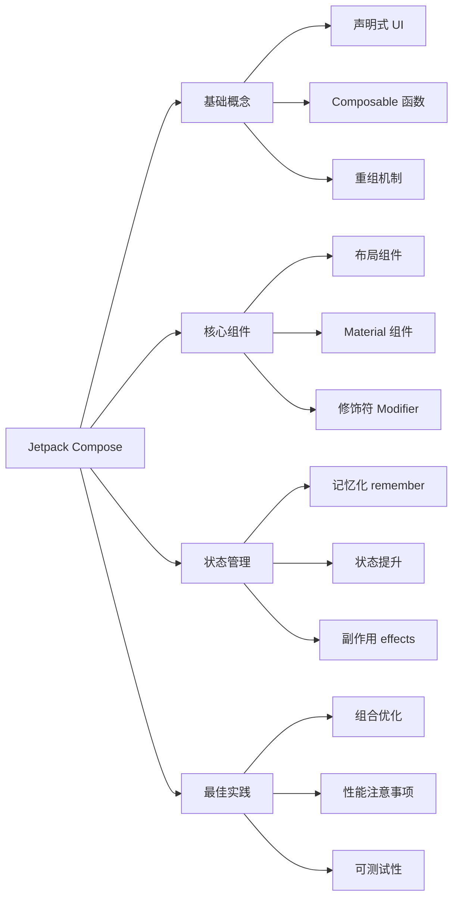

# Jetpack Compose 英文文章总结指令

## 任务描述

你的任务是对提供的 Jetpack Compose 英文技术文章进行全面、专业的内容分析和结构化总结。请将英文内容转化为中文摘要，确保保持技术准确性和专业性。总结应客观呈现原文核心思想和技术要点，以清晰的结构组织内容，方便中文读者快速理解和应用。

## 具体要求

摘要必须包含以下两个主要部分：

- 文字摘要
- 思维导图

### 第一部分：文字摘要

#### 基本要素

- **核心概述**：用中文提供简洁明了的文章核心内容概述。
- **关键技术点**：列出文章中提到的关键 Compose 特性、组件或概念（以要点形式呈现）。
- **UI 示例**：如果原文包含 UI 代码示例，请遵循以下要求：
  - 提供相应的 Composable 函数代码片段
  - 确保代码示例是可以直接运行的完整代码：包含必要的导入语句和 `@Composable` 注解
  - 适当添加预览函数 `@Preview` 以展示 UI 效果
  - 如可能，添加简单的预期 UI 效果描述或示意图
  - 不必全部照搬原文示例，选择最能加强对摘要理解的关键示例即可
- **目标分析**：总结文章的主要目的和目标受众（如初学者、有经验的 Android 开发者等）。
- **技术价值**：指出文章中最有价值的技术见解和实践建议。

#### 扩展分析（如适用）

- **版本适用性**：说明文章内容适用的 Compose 版本范围。
- **与传统视图系统对比**：如文章涉及与传统 Android View 系统的对比，请简要总结主要差异。
- **性能考量**：总结文章中提及的性能优化建议或注意事项。
- **状态管理**：分析文章中关于 Compose 状态管理的关键点。
- **最佳实践**：提炼文章中的 Compose 编程最佳实践。
- **动画与过渡**：如文章涉及动画和过渡效果，请特别总结相关技术要点。
- **主题与样式**：总结关于 Material Design 主题和自定义样式的关键点。

#### 质量要求与规范

1. **内容准确性**：保持客观、准确的总结，不添加个人观点或无关内容。
2. **技术聚焦**：突出文章中的技术亮点、创新点和核心价值。
3. **概念解释**：对于文章中的复杂概念，请用简单易懂的语言解释。
4. **示例完整性**：确保提供的 Compose 代码示例结构完整，包含必要的上下文和注解。
5. **批判思考**：如有必要，可以指出文章中的局限性、不足或可能的改进点。
6. **格式规范**：保持文字排版整洁，遵循中文文案排版规范。
7. **术语一致性**：保持专业术语翻译的一致性，首次出现的专业术语考虑中英文并用。
8. **引用标注**：如需引用原文观点，请使用引用格式并注明出处。
9. **代码示例规范**：提供的代码示例必须是结构完整的，应包含必要的导入语句、Composable 函数声明和预览函数，并添加中文注释说明关键功能和要点。

### 第二部分：思维导图

- 使用 Mermaid 语法创建一个清晰的思维导图，展示文章的逻辑结构和知识框架。
- 思维导图必须包含：主题、子主题和关键知识点。
- 根据文章内容组织适当的层级结构，反映 Compose 特有的概念层级关系。
- 节点描述应清晰表达核心概念。
- **必须使用 Mermaid 的 flowchart LR 类型**（从左到右的流程图）。

#### 思维导图示例格式

以下是一个 Jetpack Compose 技术文章思维导图的示例：

> 注意：上述示例仅供参考。实际绘制时，请根据文章实际内容确定主题、结构和知识点，确保节点描述能清晰传达核心概念。使用 flowchart LR 语法创建从左到右的流程图，以清晰展示概念间的层级和关联关系。

## 注意事项

1. 总结应保持原文的技术准确性，同时使用清晰的中文表达。
2. 特别关注 Compose 的独特概念如重组（Recomposition）、单向数据流、副作用（Side-effects）等。
3. 如文章包含与其他 Jetpack 库（如 Navigation、ViewModel 等）的集成内容，请单独总结这部分内容。
4. 对于 Material Design 3 相关内容，请特别标注并详细总结。
5. 代码示例应尽可能简洁但完整，确保表达核心概念的同时可以直接运行。 