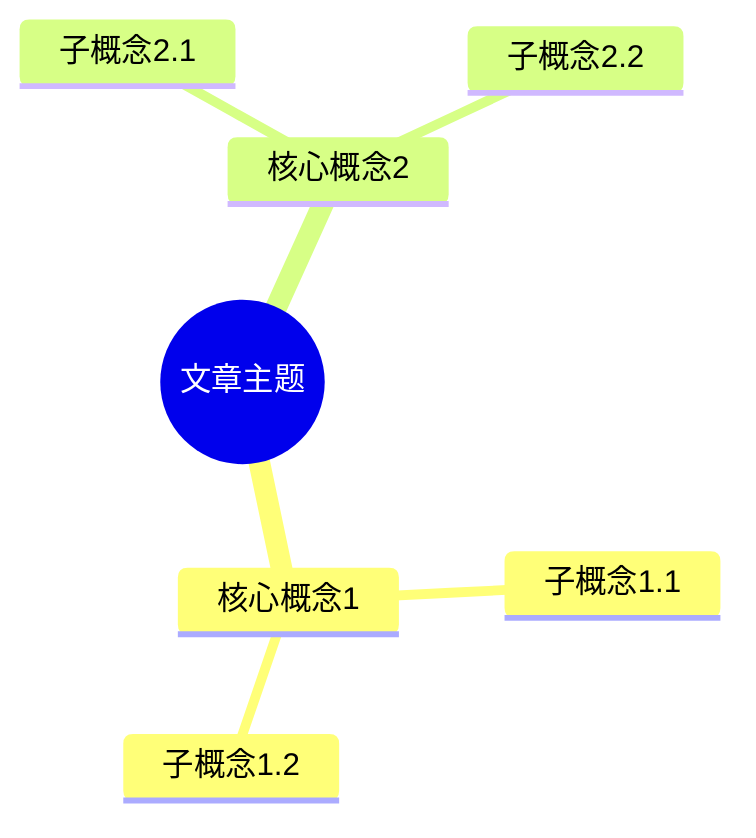

# Kotlin 英文文章总结摘要指南

## 任务描述

请对提供的 Kotlin 英文技术文章进行全面、专业的内容分析和结构化总结。总结应保持客观性，突出技术要点，并以清晰的结构呈现文章的核心思想和逻辑框架。

摘要必须包含以下两个主要部分：

## 第一部分：文字摘要

- 核心概述：请用中文提供简洁明了的文章核心内容概述（200-300字）
- 关键技术点：列出文章中提到的关键 Kotlin 特性、技术或概念（以要点形式呈现）
- 目标分析：总结文章的主要目的和目标受众
- 技术价值：指出文章中最有价值的技术见解和实践建议
- 代码示例：如有代码示例，请选择并解释 1-2 个最具代表性的示例，说明其技术要点

## 第二部分：思维导图

- 使用 Mermaid 语法创建一个清晰的思维导图，展示文章的逻辑结构和知识框架
- 思维导图必须包含：主题、子主题和关键知识点
- 层级结构要合理，建议不超过 3 层
- 节点描述要简洁（每个节点建议不超过 5 个字）
- **必须使用 Mermaid 的 mindmap 类型**（而非其他图表类型）

## 质量要求与规范

1. 内容准确性：保持客观、准确的总结，不添加个人观点或无关内容
2. 技术聚焦：突出文章中的技术亮点、创新点和核心价值
3. 概念解释：对于文章中的复杂概念，请用简单易懂的语言解释
4. 数据呈现：如文章包含性能比较或基准测试，请在摘要中提及关键数据和结论
5. 批判思考：如有必要，可以指出文章中的局限性、不足或可能的改进点
6. 格式规范：保持文字排版整洁，遵循中文文案排版规范

## 思维导图示例格式

