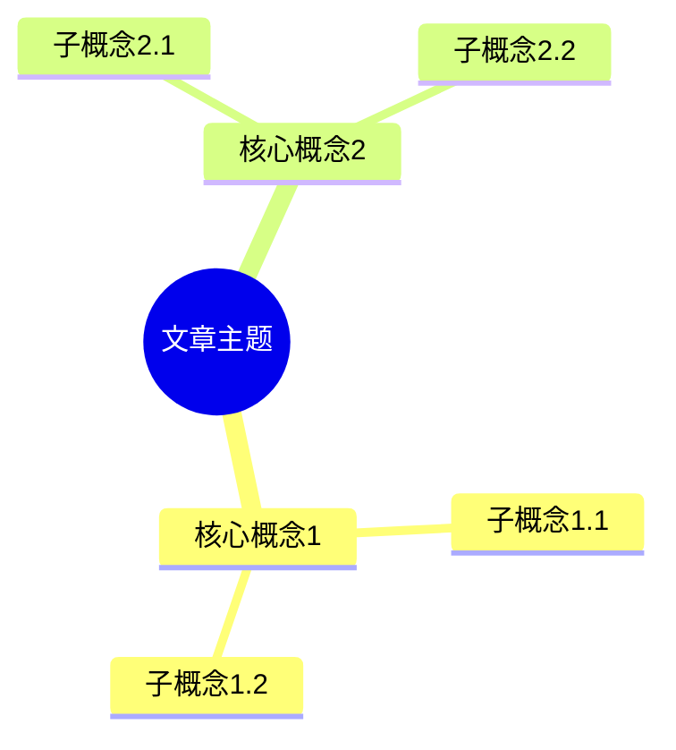

# Kotlin 英文文章总结摘要指南

摘要应包含两个主要部分：

### 第一部分：文字摘要

- 请用中文提供简洁明了的文章核心内容概述（200-300字）
- 列出文章中提到的关键 Kotlin 特性、技术或概念（以要点形式呈现）
- 总结文章的主要目的和目标受众
- 指出文章中最有价值的技术见解和实践建议
- 如有代码示例，请选择并解释 1-2 个最具代表性的示例

### 第二部分：思维导图

- 请使用 Mermaid 语法创建一个清晰的思维导图，展示文章的逻辑结构
- 思维导图应包含主题、子主题和关键点
- 使用合理的层级结构
- 确保节点描述简洁
- **必须使用 Mermaid 的 mindmap 类型**（而非 flowchart）

## 要求与规范

1. 请保持客观、准确的总结，不添加个人观点
2. 突出文章中的技术亮点和创新点
3. 对于文章中的复杂概念，请用简单语言解释
4. 如文章包含性能比较或基准测试，请在摘要中提及关键数据
5. 如有必要，可以指出文章中的局限性或可能的改进点

## 思维导图示例格式

