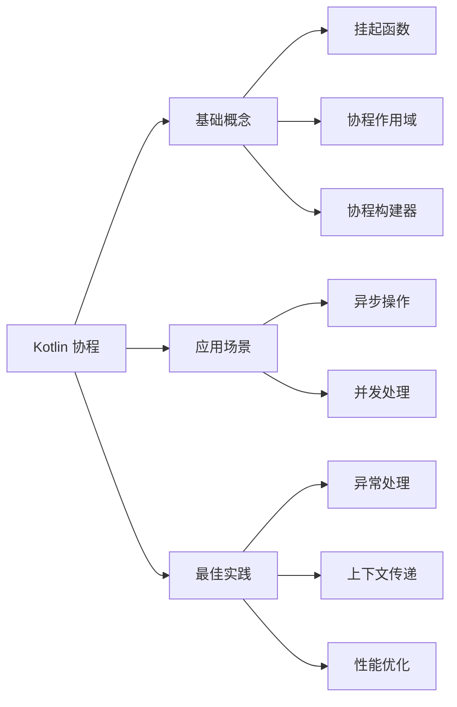

<!-- modified: 2025-03-27 -->
# Kotlin 英文文章总结要求

## 任务描述

请对提供的 Kotlin 英文技术文章进行全面、专业的内容分析和结构化总结。总结应保持客观性，突出技术要点，并以清晰的结构呈现文章的核心思想和逻辑框架。

摘要必须包含以下两个主要部分：

- 文字摘要
- 思维导图

## 第一部分：文字摘要

### 基本要素

- **核心概述**：用中文提供简洁明了的文章核心内容概述。
- **关键技术点**：列出文章中提到的关键 Kotlin 特性、技术或概念（以要点形式呈现）。
- **代码示例**：如果原文包含代码示例，必须提供相应的代码片段，且确保代码示例是可以直接运行的完整代码（例如包含在 `main` 函数内或提供完整的执行上下文）。不必全部照搬原文示例，选择最能加强对摘要理解的关键示例即可。
- **目标分析**：总结文章的主要目的和目标受众。
- **技术价值**：指出文章中最有价值的技术见解和实践建议。

### 扩展分析（如适用）

- **版本适用性**：说明文章内容适用的 Kotlin 版本范围。
- **与 Java 对比**：如文章涉及与 Java 的对比，请简要总结主要差异。
- **性能考量**：总结文章中提及的性能优化建议或注意事项。
- **最佳实践**：提炼文章中的 Kotlin 编程最佳实践。

## 第二部分：思维导图

- 使用 Mermaid 语法创建一个清晰的思维导图，展示文章的逻辑结构和知识框架。
- 思维导图必须包含：主题、子主题和关键知识点。
- 根据文章内容组织适当的层级结构。
- 节点描述应清晰表达核心概念。
- **必须使用 Mermaid 的 flowchart LR 类型**（从左到右的流程图）。

## 质量要求与规范

1. **内容准确性**：保持客观、准确的总结，不添加个人观点或无关内容。
2. **技术聚焦**：突出文章中的技术亮点、创新点和核心价值。
3. **概念解释**：对于文章中的复杂概念，请用简单易懂的语言解释。
4. **数据呈现**：如文章包含性能比较或基准测试，请在摘要中提及关键数据和结论。
5. **批判思考**：如有必要，可以指出文章中的局限性、不足或可能的改进点。
6. **格式规范**：保持文字排版整洁，遵循中文文案排版规范。
7. **术语一致性**：保持专业术语翻译的一致性，首次出现的专业术语考虑中英文并用。
8. **引用标注**：如需引用原文观点，请使用引用格式并注明出处。
9. **代码示例规范**：提供的代码示例必须是完整可运行的，应包含必要的导入语句、`main` 函数或其他执行上下文，并添加中文注释说明关键功能和要点。

## 思维导图示例格式

以下是一个 Kotlin 技术文章思维导图的示例：

> 注意：上述示例仅供参考。实际绘制时，请根据文章实际内容确定主题、结构和知识点，确保节点描述能清晰传达核心概念。使用 flowchart LR 语法创建从左到右的流程图，以清晰展示概念间的层级和关联关系。
